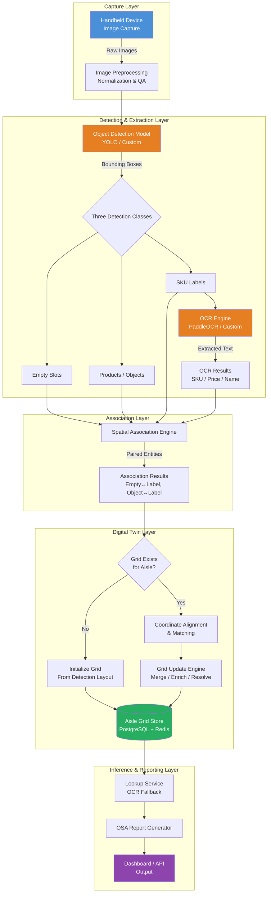
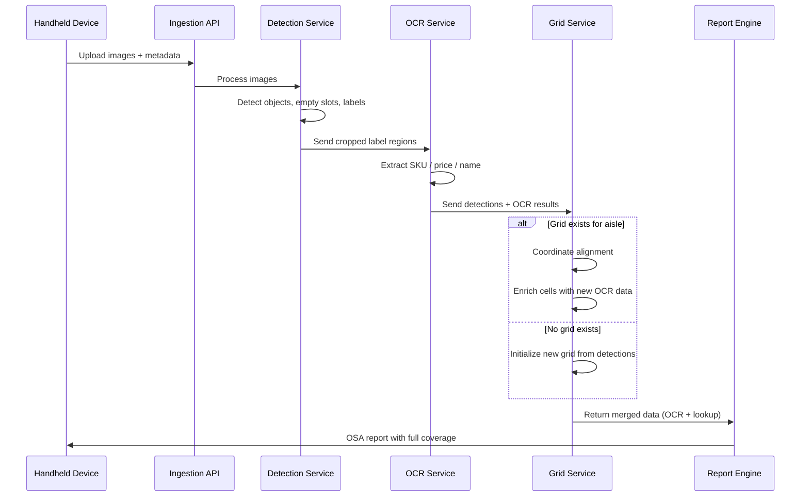
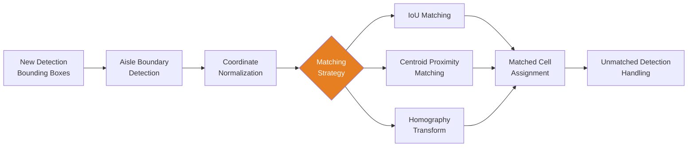
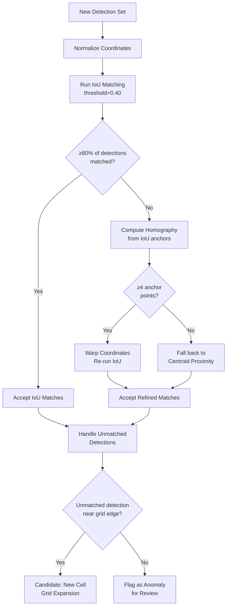
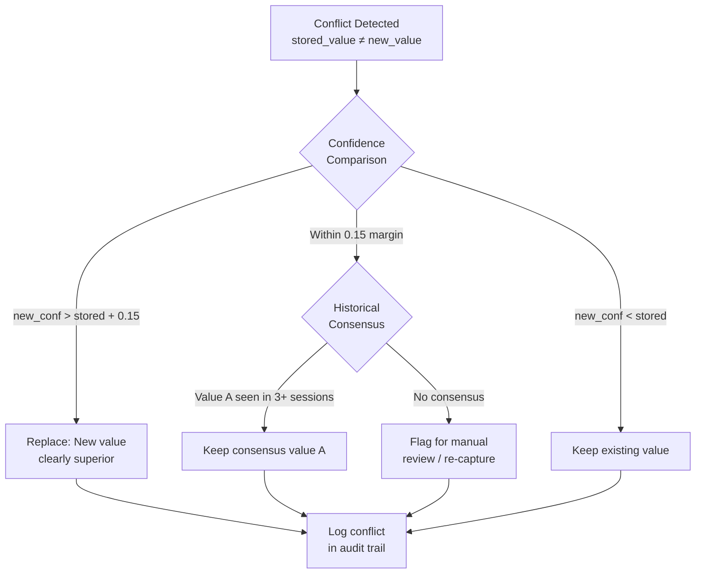
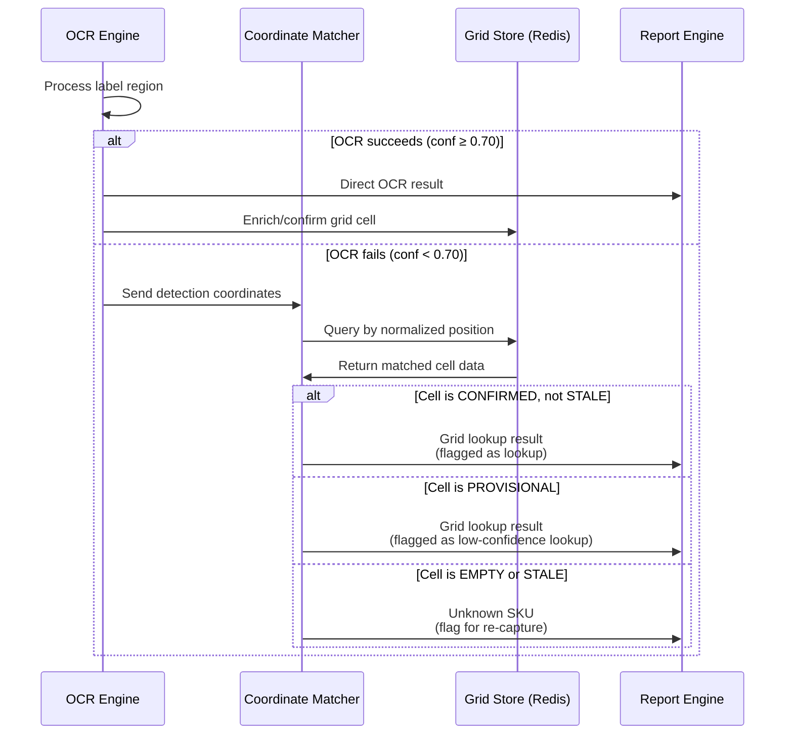

# On-Shelf Availability (OSA) Digital Twin System for Retail

**Version:** 1.0  
**Date:** February 2026  
**Status:** Technical Design Document  

---

## Table of Contents

1. [Executive Summary](#1-executive-summary)
2. [System Architecture Overview](#2-system-architecture-overview)
3. [Pipeline Description](#3-pipeline-description)
4. [Digital Twin Grid Design](#4-digital-twin-grid-design)
5. [Coordinate Alignment & Matching Logic](#5-coordinate-alignment--matching-logic)
6. [Incremental Enrichment Strategy](#6-incremental-enrichment-strategy)
7. [Fallback & Lookup Mechanism](#7-fallback--lookup-mechanism)
8. [Data Schema & Storage](#8-data-schema--storage)
9. [Challenges & Mitigations](#9-challenges--mitigations)
10. [Success Metrics & KPIs](#10-success-metrics--kpis)
11. [Implementation Roadmap](#11-implementation-roadmap)

---

## 1. Executive Summary

### Problem

Retail on-shelf availability (OSA) monitoring depends on accurately identifying which products are present, missing, or misplaced on store shelves. Current systems use handheld devices to capture aisle images, which are processed through an object detection and OCR pipeline to identify empty slots, products, and their associated SKU labels. However, the inherent challenges of handheld image capture — motion blur, inconsistent lighting, oblique camera angles, and varying distances — mean that OCR can only successfully extract text from approximately **50% of SKU labels** in any single capture session. This creates a persistent blind spot: the system detects that a label exists but cannot read what it says for half the shelf.

### Solution

The **Aisle Digital Twin** is a persistent, coordinate-anchored wireframe grid that models each store aisle's shelf layout and accumulates OCR knowledge across multiple capture sessions over time. On the first capture, the grid is initialized with bounding box positions for all detected SKU labels, and roughly 50% of cells are populated with extracted text (SKU number, price, item name). On subsequent captures — across hours, days, or weeks — newly readable labels are matched to their reference grid positions via coordinate alignment algorithms and used to fill previously empty cells. Over a typical one-week enrichment window, grid coverage converges toward 90–100%.

Once sufficiently populated, the grid acts as a **real-time lookup layer**: if OCR fails on a label during a new capture, the system retrieves the known SKU data from the grid based on the label's detected spatial position. This eliminates the dependency on per-session OCR quality and enables reliable, high-coverage OSA reporting from day one of full grid maturity.

### Business Value

| Dimension | Impact |
|-----------|--------|
| **OSA Accuracy** | From ~50% SKU identification per session to 90–100% after grid maturation |
| **Operational Efficiency** | No need for perfect image quality on every visit; the system self-heals over time |
| **Reduced Re-capture** | Associates no longer need to re-photograph aisles for missed labels |
| **Planogram Compliance** | Full grid enables position-aware compliance checks against expected planograms |
| **Scalability** | Grid-per-aisle architecture scales to hundreds of stores with independent maturation timelines |

---

## 2. System Architecture Overview

### High-Level Architecture



### Component Summary

| Component | Technology | Purpose |
|-----------|-----------|---------|
| Image Capture | Mobile app (Android/iOS) | Captures shelf images via handheld device |
| Image Preprocessing | OpenCV, custom filters | Normalize exposure, detect blur, quality scoring |
| Object Detection | YOLOv8 / Custom YOLO variant | Detect empty slots, products, SKU labels |
| Spatial Association | Custom heuristic engine | Link detected objects to their nearest SKU labels |
| OCR Engine | PaddleOCR (OpenVINO optimized) | Extract text from SKU label regions |
| Coordinate Alignment | IoU + centroid matching | Match new detections to existing grid positions |
| Grid Store | PostgreSQL + Redis cache | Persist and query aisle grid data |
| Lookup Service | REST API / gRPC | Real-time OCR fallback from grid |
| Reporting | Dashboard + API | OSA metrics, coverage reports, alerts |

---

## 3. Pipeline Description

The end-to-end pipeline is a six-stage process from image capture to actionable OSA output. Each stage feeds into the next, with the Digital Twin grid serving as both a write target (enrichment) and a read source (fallback lookup).

### Stage 1: Image Capture

A store associate walks an aisle with a handheld device, capturing overlapping images that collectively cover the full shelf span. Each image is tagged with metadata:

| Field | Example | Purpose |
|-------|---------|---------|
| `store_id` | `STR-0042` | Identifies the store location |
| `aisle_id` | `A07` | Identifies the specific aisle |
| `capture_session_id` | `sess-20260224-001` | Groups images from a single walk-through |
| `timestamp` | `2026-02-24T14:32:00Z` | Temporal ordering |
| `device_orientation` | `landscape` | Capture angle metadata |
| `image_quality_score` | `0.72` | Auto-computed blur/exposure score |

Images with quality scores below a configurable threshold (e.g., < 0.3) are flagged for re-capture but still processed — the detection model is more robust to blur than OCR.

### Stage 2: Object Detection

Each image is passed through the object detection model, which produces bounding boxes for three classes:

```
┌─────────────────────────────────────────────────────────┐
│  Shelf Image                                            │
│                                                         │
│  ┌──────────┐  ┌──────────┐  ┌──────────┐              │
│  │ Product  │  │  EMPTY   │  │ Product  │   ← Shelf 2  │
│  │  (obj)   │  │  SLOT    │  │  (obj)   │              │
│  └──────────┘  └──────────┘  └──────────┘              │
│  ┌──SKU──┐     ┌──SKU──┐     ┌──SKU──┐                 │
│  │$3.99  │     │$2.49  │     │$5.99  │    ← Labels     │
│  │Cereal │     │Oats   │     │Granola│                 │
│  └───────┘     └───────┘     └───────┘                 │
│                                                         │
│  ┌──────────┐  ┌──────────┐  ┌──────────┐              │
│  │ Product  │  │ Product  │  │  EMPTY   │   ← Shelf 1  │
│  │  (obj)   │  │  (obj)   │  │  SLOT    │              │
│  └──────────┘  └──────────┘  └──────────┘              │
│  ┌──SKU──┐     ┌──SKU──┐     ┌──SKU──┐                 │
│  │$1.99  │     │$4.29  │     │??????│    ← OCR fail   │
│  │Bread  │     │Jam    │     │??????│                 │
│  └───────┘     └───────┘     └───────┘                 │
└─────────────────────────────────────────────────────────┘
```

Each detection produces a bounding box in `[x_min, y_min, x_max, y_max]` pixel coordinates with an associated class label and confidence score.

### Stage 3: Spatial Association

The association engine pairs detected entities using vertical proximity and horizontal overlap heuristics:

- **Object ↔ SKU Label**: A product bounding box is associated with the SKU label directly below it (within a vertical distance threshold) that has the highest horizontal overlap (IoU on the x-axis).
- **Empty Slot ↔ SKU Label**: Same logic — an empty slot is matched to its nearest below-positioned label.

The output is a list of triplets: `(entity_type, entity_bbox, sku_label_bbox)`.

### Stage 4: OCR Extraction

Each associated SKU label region is cropped from the image and passed through the OCR engine. The OCR model attempts to extract three fields:

| Field | Description | Example |
|-------|-------------|---------|
| `sku_number` | Numeric product identifier | `00491820034` |
| `price` | Displayed price | `$3.99` |
| `item_name` | Product description text | `Honey Nut Cereal 14oz` |

Each extracted field carries a per-field confidence score (0.0–1.0). A label is considered "successfully read" if at least the `sku_number` field exceeds the confidence threshold (default: 0.7). In a typical session, ~50% of labels meet this threshold.

### Stage 5: Grid Update (Digital Twin Enrichment)

Successfully extracted label data is matched to the aisle's existing Digital Twin grid (or used to initialize a new grid). This stage performs coordinate alignment, conflict resolution, and cell population. See Sections 4–6 for detailed design.

### Stage 6: Lookup & Reporting

For labels where OCR fails, the system queries the Digital Twin grid by spatial position to retrieve previously stored SKU data. The combined results (direct OCR + grid lookup) feed into the OSA report, which identifies:

- Which products are present on the shelf
- Which slots are empty and what product should be there
- Planogram compliance deviations
- SKU coverage metrics



---

## 4. Digital Twin Grid Design

### Conceptual Model

The Digital Twin grid represents a physical aisle as a **2D matrix of cells**, where each cell corresponds to a single SKU label position on the shelf. The grid is organized by shelf level (rows) and horizontal position (columns), mirroring the physical layout.

```
Aisle A07 — Digital Twin Grid
═══════════════════════════════════════════════════════
Shelf 3  │ [Cell 3,1]  │ [Cell 3,2]  │ [Cell 3,3]  │ [Cell 3,4]  │
         │ SKU: 04918  │ SKU: -----  │ SKU: 03822  │ SKU: 07331  │
         │ Conf: 0.92  │ Conf: ----  │ Conf: 0.88  │ Conf: 0.95  │
─────────┼─────────────┼─────────────┼─────────────┼─────────────┤
Shelf 2  │ [Cell 2,1]  │ [Cell 2,2]  │ [Cell 2,3]  │ [Cell 2,4]  │
         │ SKU: 01234  │ SKU: 05678  │ SKU: -----  │ SKU: 09012  │
         │ Conf: 0.85  │ Conf: 0.91  │ Conf: ----  │ Conf: 0.78  │
─────────┼─────────────┼─────────────┼─────────────┼─────────────┤
Shelf 1  │ [Cell 1,1]  │ [Cell 1,2]  │ [Cell 1,3]  │ [Cell 1,4]  │
         │ SKU: 03456  │ SKU: 07890  │ SKU: 02345  │ SKU: -----  │
         │ Conf: 0.94  │ Conf: 0.82  │ Conf: 0.76  │ Conf: ----  │
═══════════════════════════════════════════════════════
         Fill Rate: 9/12 = 75%
```

### Grid Coordinate System

Each cell is anchored to a **normalized coordinate position** rather than raw pixel coordinates, allowing comparisons across captures with different camera positions, zoom levels, and angles. The normalization scheme uses the full aisle span as the reference frame:

| Coordinate | Definition | Range |
|------------|-----------|-------|
| `shelf_level` | Integer shelf row, bottom-up | 1, 2, 3, ... |
| `norm_x_center` | Horizontal center of label bbox, normalized to aisle width | 0.0 – 1.0 |
| `norm_y_center` | Vertical center of label bbox, normalized to aisle height | 0.0 – 1.0 |
| `norm_width` | Width of label bbox, normalized | 0.0 – 1.0 |
| `norm_height` | Height of label bbox, normalized | 0.0 – 1.0 |

**Normalization** is performed relative to the detected aisle boundary (or image edges as a fallback):

```
norm_x_center = (label_x_center - aisle_x_min) / (aisle_x_max - aisle_x_min)
norm_y_center = (label_y_center - aisle_y_min) / (aisle_y_max - aisle_y_min)
```

### Grid Cell Schema

Each cell in the grid is a structured record:

```json
{
  "cell_id": "A07-S2-C003",
  "store_id": "STR-0042",
  "aisle_id": "A07",
  "shelf_level": 2,
  "column_index": 3,
  "ref_norm_x": 0.4521,
  "ref_norm_y": 0.6234,
  "ref_norm_w": 0.0832,
  "ref_norm_h": 0.0415,
  "sku_number": "00491820034",
  "sku_confidence": 0.92,
  "price": "$3.99",
  "price_confidence": 0.88,
  "item_name": "Honey Nut Cereal 14oz",
  "name_confidence": 0.71,
  "overall_confidence": 0.84,
  "first_seen_session": "sess-20260217-001",
  "last_updated_session": "sess-20260222-003",
  "last_updated_at": "2026-02-22T09:15:00Z",
  "update_count": 4,
  "status": "populated"
}
```

### Persistence Layer

| Layer | Technology | Purpose |
|-------|-----------|---------|
| **Primary Store** | PostgreSQL with PostGIS | Persistent grid storage with spatial indexing |
| **Cache** | Redis | Hot-path lookup during inference (per-aisle grid cached as hash) |
| **Archive** | Object storage (S3) | Historical grid snapshots for auditing and rollback |

The PostgreSQL store uses a composite index on `(store_id, aisle_id, shelf_level, column_index)` for efficient cell lookups. A GiST spatial index on `(ref_norm_x, ref_norm_y)` enables coordinate-based nearest-neighbor queries for alignment matching.

---

## 5. Coordinate Alignment & Matching Logic

The most critical challenge in the system is reliably matching a newly detected SKU label position from a fresh capture to its corresponding cell in the existing grid. Camera position, angle, zoom, and lens distortion all vary between sessions, so raw pixel coordinates are not directly comparable.

### Alignment Pipeline



### Strategy 1: IoU-Based Matching (Primary)

After normalization, compute the Intersection-over-Union (IoU) between each new detection's normalized bounding box and every existing grid cell's reference bounding box. A match is accepted if IoU exceeds a threshold.

```
IoU(A, B) = Area(A ∩ B) / Area(A ∪ B)

Match criteria:
  - IoU ≥ 0.40 (default threshold)
  - One-to-one assignment via Hungarian algorithm to prevent duplicates
```

**Why 0.40?** Shelf labels are densely packed but spatially stable. A threshold of 0.40 accommodates moderate perspective shifts while preventing cross-assignment to adjacent labels. This threshold is tunable per store based on observed alignment variance.

### Strategy 2: Centroid Proximity (Fallback)

When IoU matching fails (e.g., significant perspective distortion), fall back to nearest-centroid matching:

```
distance = sqrt((norm_x_new - ref_norm_x)² + (norm_y_new - ref_norm_y)²)

Match criteria:
  - distance < max_centroid_distance (default: 0.05 in normalized space)
  - Nearest unmatched cell wins
  - Shelf level must agree (within ±1 level for edge cases)
```

### Strategy 3: Homography Transform (Advanced)

For captures with significant perspective distortion, compute a homography matrix using matched anchor points (labels that were already high-confidence matches via IoU). Apply the transform to warp all remaining detection coordinates into the grid's reference frame before re-running IoU matching.

```
H = findHomography(src_points, dst_points, RANSAC)
transformed_coords = H @ detection_coords

# src_points = centroids of successfully IoU-matched detections
# dst_points = reference centroids of their matched grid cells
# Minimum 4 anchor matches required to compute homography
```

### Matching Decision Flow



### Handling Unmatched Detections

Detections that cannot be matched to any existing grid cell fall into two categories:

1. **Grid expansion candidates**: Detections at the edges of the grid that likely represent labels previously outside the capture frame. These are added as new cells after two consecutive sessions confirm the position.
2. **Planogram change signals**: Detections in the interior of the grid with no nearby cell may indicate a shelf reset or product repositioning. These trigger a planogram change review workflow.

---

## 6. Incremental Enrichment Strategy

### Day-Over-Day Accumulation

The grid is designed to converge toward full coverage over multiple capture sessions. The accumulation model assumes typical OCR success rates and independent label readability across sessions:

| Session | New Labels Read | Cumulative Readable | Grid Fill Rate |
|---------|----------------|--------------------:|---------------:|
| Day 1 (Session 1) | 50% of labels | 50% | **50%** |
| Day 2 (Session 2) | 50% of labels | ~75% (some overlap with Day 1) | **~75%** |
| Day 3 (Session 3) | 50% of labels | ~87% | **~87%** |
| Day 5 (Session 5) | 50% of labels | ~97% | **~97%** |
| Day 7 (Session 7) | — | ~99% | **~99%** |

This assumes each session independently has a ~50% chance of reading any given label, and that failure is not consistently tied to the same labels (i.e., failures are partially due to capture variance, not permanent label damage). In practice, some labels may be persistently unreadable (damaged, occluded), and the convergence curve will plateau below 100%.

### Confidence Scoring

Each OCR extraction carries per-field confidence scores. The grid uses a **weighted confidence accumulation** model:

```
For each field (sku_number, price, item_name):

  If cell field is EMPTY:
      Accept new value if confidence ≥ min_threshold (0.60)
      Store value and confidence

  If cell field is POPULATED:
      If new_confidence > stored_confidence:
          Replace value and confidence
      If new_value == stored_value:
          Boost confidence: new_conf = min(1.0, stored_conf + 0.05)
      If new_value != stored_value AND new_confidence > stored_confidence:
          Trigger conflict resolution
```

### Conflict Resolution

When two sessions produce different OCR text for the same cell and field, the system applies a resolution hierarchy:



**Conflict resolution rules, in priority order:**

1. **Clear confidence superiority** (Δ > 0.15): Accept the higher-confidence value.
2. **Consensus voting**: If a value has been confirmed across 3+ independent sessions, it is considered authoritative regardless of a single conflicting read.
3. **Recency tiebreak**: If confidence is similar and no consensus exists, prefer the more recent read (assumption: prices/labels may have been updated).
4. **Manual review queue**: Persistent conflicts (same cell, 3+ different values, no consensus) are flagged for human review.

### Enrichment Lifecycle

A grid cell transitions through the following lifecycle states:

```
[EMPTY] → [PROVISIONAL] → [CONFIRMED] → [STALE] → [RE-CONFIRMED / INVALIDATED]

EMPTY:        No OCR data. Cell has position only.
PROVISIONAL:  Single-session OCR read, confidence ≥ 0.60.
CONFIRMED:    Value confirmed by 2+ sessions OR single read with confidence ≥ 0.90.
STALE:        Confirmed cell not re-observed in 14+ days (configurable).
INVALIDATED:  Planogram change detected; cell data cleared for re-population.
```

---

## 7. Fallback & Lookup Mechanism

### Live Inference Flow

When a new capture session is processed and OCR fails on a specific label, the system performs a grid lookup:



### Lookup Confidence Tiers

Results returned from grid lookup are tagged with a source and confidence tier:

| Source | Tier | Confidence Range | Usage Guidance |
|--------|------|-----------------|----------------|
| Direct OCR (current session) | **Tier 1** | ≥ 0.70 | Full trust — use directly |
| Grid lookup (CONFIRMED cell) | **Tier 2** | ≥ 0.80 (cell confidence) | High trust — use with "grid-sourced" flag |
| Grid lookup (PROVISIONAL cell) | **Tier 3** | 0.60 – 0.79 | Moderate trust — use with caveat in report |
| Grid lookup (STALE cell) | **Tier 4** | Degraded by staleness | Low trust — flag for re-capture priority |
| No data available | **Tier 5** | N/A | Unknown — queue for targeted re-capture |

### Staleness Handling

Grid data degrades over time as stores rotate products, change prices, and reset planograms. The staleness model applies a **confidence decay** to cells that haven't been re-observed:

```
effective_confidence = stored_confidence × decay_factor

Where:
  decay_factor = max(0.3, 1.0 - (days_since_last_update / staleness_window))
  staleness_window = 14 days (configurable per store/category)
  
Examples:
  0 days stale  → factor = 1.00 → effective = stored
  7 days stale  → factor = 0.50 → effective = stored × 0.50
  14 days stale → factor = 0.30 → effective = stored × 0.30 (floor)
```

When `effective_confidence` drops below 0.50, the cell transitions to `STALE` status and lookup results are flagged accordingly.

---

## 8. Data Schema & Storage

### Primary Grid Table: `grid_cells`

```sql
CREATE TABLE grid_cells (
    cell_id             VARCHAR(32) PRIMARY KEY,    -- e.g., 'A07-S2-C003'
    store_id            VARCHAR(16) NOT NULL,
    aisle_id            VARCHAR(8)  NOT NULL,
    shelf_level         SMALLINT    NOT NULL,
    column_index        SMALLINT    NOT NULL,
    
    -- Normalized reference coordinates
    ref_norm_x          FLOAT       NOT NULL,
    ref_norm_y          FLOAT       NOT NULL,
    ref_norm_w          FLOAT       NOT NULL,
    ref_norm_h          FLOAT       NOT NULL,
    
    -- OCR extracted data
    sku_number          VARCHAR(20),
    sku_confidence      FLOAT       DEFAULT 0.0,
    price               VARCHAR(12),
    price_confidence    FLOAT       DEFAULT 0.0,
    item_name           VARCHAR(128),
    name_confidence     FLOAT       DEFAULT 0.0,
    overall_confidence  FLOAT       DEFAULT 0.0,
    
    -- Lifecycle metadata
    status              VARCHAR(16) NOT NULL DEFAULT 'EMPTY',
                        -- EMPTY | PROVISIONAL | CONFIRMED | STALE | INVALIDATED
    first_seen_session  VARCHAR(32) NOT NULL,
    last_updated_session VARCHAR(32),
    last_updated_at     TIMESTAMPTZ,
    confirmation_count  SMALLINT    DEFAULT 0,
    
    -- Indexing
    created_at          TIMESTAMPTZ DEFAULT NOW(),
    updated_at          TIMESTAMPTZ DEFAULT NOW()
);

-- Composite index for aisle-level queries
CREATE INDEX idx_grid_aisle ON grid_cells (store_id, aisle_id, shelf_level, column_index);

-- Spatial index for coordinate matching
CREATE INDEX idx_grid_spatial ON grid_cells USING GIST (
    point(ref_norm_x, ref_norm_y)
);

-- Status filtering
CREATE INDEX idx_grid_status ON grid_cells (store_id, aisle_id, status);
```

### Session Log Table: `capture_sessions`

```sql
CREATE TABLE capture_sessions (
    session_id          VARCHAR(32) PRIMARY KEY,
    store_id            VARCHAR(16) NOT NULL,
    aisle_id            VARCHAR(8)  NOT NULL,
    captured_at         TIMESTAMPTZ NOT NULL,
    image_count         SMALLINT,
    total_labels_detected SMALLINT,
    ocr_success_count   SMALLINT,
    ocr_success_rate    FLOAT,
    grid_cells_updated  SMALLINT,
    grid_fill_rate_after FLOAT,
    processing_status   VARCHAR(16) DEFAULT 'PENDING'
);
```

### Conflict Audit Table: `ocr_conflicts`

```sql
CREATE TABLE ocr_conflicts (
    conflict_id         SERIAL PRIMARY KEY,
    cell_id             VARCHAR(32) REFERENCES grid_cells(cell_id),
    field_name          VARCHAR(16),         -- 'sku_number', 'price', 'item_name'
    stored_value        VARCHAR(128),
    stored_confidence   FLOAT,
    new_value           VARCHAR(128),
    new_confidence      FLOAT,
    resolution          VARCHAR(16),         -- 'REPLACED', 'KEPT', 'MANUAL_REVIEW'
    session_id          VARCHAR(32),
    resolved_at         TIMESTAMPTZ DEFAULT NOW()
);
```

### Redis Cache Structure

For sub-millisecond lookup during live inference, the active grid for each aisle is cached in Redis:

```
Key:    grid:{store_id}:{aisle_id}
Type:   Hash
Field:  {shelf_level}:{column_index}
Value:  JSON-encoded cell data (sku_number, price, item_name, confidence, status)

TTL:    24 hours (refreshed on each capture session)

Example:
  HSET grid:STR-0042:A07 "2:3" '{"sku":"00491820034","price":"$3.99","name":"Honey Nut Cereal 14oz","conf":0.92,"status":"CONFIRMED"}'
```

A secondary spatial index in Redis is maintained using sorted sets for coordinate-based lookups:

```
Key:    grid_x:{store_id}:{aisle_id}
Type:   Sorted Set
Score:  ref_norm_x
Member: cell_id

Key:    grid_y:{store_id}:{aisle_id}
Type:   Sorted Set
Score:  ref_norm_y
Member: cell_id
```

Coordinate matching queries use `ZRANGEBYSCORE` on both axes and intersect results.

---

## 9. Challenges & Mitigations

### Technical Risk Matrix

| # | Risk | Severity | Likelihood | Mitigation |
|---|------|----------|------------|------------|
| 1 | **Planogram resets** — Store reshuffles products, invalidating grid positions | High | Medium | Detect via mass unmatched detections (>30% unmatched in a session triggers reset workflow). Maintain grid version history for rollback. |
| 2 | **Camera angle variance** — Different associates hold device at different heights/angles | Medium | High | Normalization layer absorbs moderate variance. Homography fallback for severe distortion. Provide device-mounted guide or AR overlay for consistent framing. |
| 3 | **Coordinate drift** — Gradual shift in normalized coordinates across sessions due to aisle boundary detection inconsistency | Medium | Medium | Use stable shelf-edge features as anchor points for normalization. Implement running average of aisle boundary coordinates with outlier rejection. |
| 4 | **Persistent OCR failures** — Some labels are always unreadable (damaged, occluded by product overhang, reflective surface) | Medium | High | After 5+ sessions with failed OCR on the same cell, flag for manual data entry. Allow manual override via admin interface. |
| 5 | **Price changes** — Prices update frequently, but stale grid data shows old prices | High | High | Staleness decay model (Section 7) reduces confidence of old price data. Price field uses a shorter staleness window (7 days vs. 14 for SKU). Consider price-specific re-capture triggers. |
| 6 | **Duplicate products** — Same SKU appears in multiple positions; coordinate match assigns to wrong cell | Low | Medium | Grid cells are position-anchored, not SKU-anchored. Each physical position is a unique cell regardless of SKU content. Matching is purely spatial. |
| 7 | **Multi-image stitching errors** — Overlapping images from a single session produce duplicate detections for the same label | Medium | Medium | Deduplicate detections within a session using NMS (Non-Maximum Suppression) across overlapping image regions before grid update. |
| 8 | **Scale variance** — Images captured at different distances produce different label sizes in pixel space | Low | Medium | Normalization to aisle-relative coordinates absorbs scale. Minimum label size threshold filters noise from distant captures. |

### Planogram Change Detection

A dedicated detector monitors for bulk grid invalidation events:

```python
def detect_planogram_change(session_matches, grid_cell_count):
    """
    Trigger planogram change review if alignment anomalies exceed threshold.
    """
    unmatched_ratio = session_matches['unmatched'] / session_matches['total_detections']
    new_position_ratio = session_matches['new_positions'] / grid_cell_count
    
    if unmatched_ratio > 0.30 or new_position_ratio > 0.20:
        return PlanogramChangeAlert(
            severity='HIGH',
            action='FREEZE_GRID_UPDATES',
            recommendation='Manual verification required before grid rebuild'
        )
    return None
```

---

## 10. Success Metrics & KPIs

### Primary Metrics

| Metric | Definition | Target | Measurement |
|--------|-----------|--------|-------------|
| **Grid Fill Rate** | % of grid cells with status ≥ PROVISIONAL | ≥ 90% within 5 sessions | Per aisle, per store |
| **Effective SKU Coverage** | % of detected labels with known SKU data (direct OCR + grid lookup) | ≥ 95% at grid maturity | Per capture session |
| **OSA Accuracy** | Agreement between system-reported shelf status and ground truth audits | ≥ 92% | Weekly audit sampling |
| **Time to Grid Maturity** | Sessions required for grid fill rate to reach 90% | ≤ 5 sessions | Per aisle |

### Secondary Metrics

| Metric | Definition | Target |
|--------|-----------|--------|
| **Direct OCR Success Rate** | % of labels successfully read per session (no grid assist) | Track trend; expect ~50% |
| **Lookup Utilization Rate** | % of results sourced from grid lookup vs. direct OCR | Expect 30–50% at maturity |
| **Conflict Rate** | % of grid updates triggering conflict resolution | < 5% |
| **Staleness Rate** | % of grid cells in STALE status at any time | < 10% with regular captures |
| **Planogram Change Detection Rate** | % of actual planogram changes detected automatically | ≥ 85% |
| **Grid Lookup Latency (p99)** | Response time for coordinate-based cell lookup | < 10ms |

### Monitoring Dashboard

Key visualizations for ongoing operations:

- **Grid fill heatmap**: Per-aisle color-coded grid showing cell status (empty / provisional / confirmed / stale)
- **Coverage convergence curve**: Fill rate over sessions for each aisle, compared to theoretical model
- **Conflict resolution log**: Filterable view of recent conflicts and their resolutions
- **Staleness alert feed**: Cells approaching or exceeding staleness thresholds
- **Store-level coverage summary**: Aggregate fill rate across all aisles per store

---

## 11. Implementation Roadmap

### Phase 1: Foundation (Weeks 1–4)

**Goal:** Core pipeline with grid initialization, no enrichment or lookup.

| Deliverable | Description |
|------------|-------------|
| Database schema deployment | PostgreSQL + Redis infrastructure, tables, indices |
| Grid initialization service | Process a capture session → create grid from detections + OCR |
| Coordinate normalization | Aisle boundary detection, normalized coordinate computation |
| Basic admin UI | View grid state per aisle, cell-level detail |
| Unit & integration tests | Grid creation, coordinate normalization, cell schema validation |

**Exit criteria:** A single capture session for an aisle produces a stored grid with ~50% populated cells.

### Phase 2: Enrichment Engine (Weeks 5–8)

**Goal:** Multi-session grid enrichment with coordinate alignment and conflict resolution.

| Deliverable | Description |
|------------|-------------|
| IoU-based coordinate matching | Match new detections to existing grid cells |
| Centroid proximity fallback | Secondary matching strategy |
| Incremental cell update logic | Confidence-weighted enrichment with lifecycle transitions |
| Conflict resolution engine | Rules-based conflict handling with audit logging |
| Session tracking & metrics | `capture_sessions` table, per-session stats |

**Exit criteria:** Grid fill rate demonstrably increases across 5+ sessions for test aisles. Conflict resolution handles divergent OCR reads correctly.

### Phase 3: Lookup & Fallback (Weeks 9–11)

**Goal:** Real-time grid lookup for OCR failures, staleness management.

| Deliverable | Description |
|------------|-------------|
| Redis cache layer | Hot-path grid caching with spatial lookup |
| Lookup service API | gRPC/REST endpoint for coordinate-based cell retrieval |
| Staleness decay model | Confidence degradation over time, status transitions |
| Tiered result reporting | Source attribution (direct OCR vs. grid lookup) in reports |
| Lookup latency optimization | Target < 10ms p99 |

**Exit criteria:** Effective SKU coverage ≥ 90% for aisles with mature grids. Lookup latency meets target.

### Phase 4: Advanced Alignment & Resilience (Weeks 12–15)

**Goal:** Homography support, planogram change detection, edge case handling.

| Deliverable | Description |
|------------|-------------|
| Homography alignment | Anchor-based perspective transform for distorted captures |
| Planogram change detector | Anomaly detection triggering grid freeze/rebuild |
| Grid versioning & rollback | Snapshot history with restore capability |
| Manual override interface | Admin tool for manual cell data entry |
| Multi-image deduplication | NMS across overlapping session images |

**Exit criteria:** System handles planogram resets gracefully. Alignment works across diverse capture conditions.

### Phase 5: Production Hardening & Scale (Weeks 16–20)

**Goal:** Multi-store deployment, monitoring, and operational readiness.

| Deliverable | Description |
|------------|-------------|
| Monitoring dashboard | Grid fill heatmaps, convergence curves, alerts |
| Multi-store orchestration | Independent grid lifecycle per store/aisle |
| Performance optimization | Batch processing, connection pooling, cache tuning |
| Alerting & SLA management | Staleness alerts, coverage degradation alerts |
| Documentation & runbooks | Operational guides, troubleshooting, on-call procedures |
| Load testing | Validate at target scale (N stores × M aisles) |

**Exit criteria:** System deployed to 3+ pilot stores with stable operation for 2+ weeks. All KPIs within target ranges.

---

## Appendix A: Glossary

| Term | Definition |
|------|-----------|
| **OSA** | On-Shelf Availability — whether expected products are physically present on the shelf |
| **SKU** | Stock Keeping Unit — unique product identifier |
| **Digital Twin** | Persistent virtual representation of a physical aisle's label layout |
| **Grid Cell** | A single position in the digital twin, corresponding to one SKU label location |
| **Planogram** | The prescribed layout of products on a shelf, dictated by the retailer |
| **IoU** | Intersection over Union — a measure of bounding box overlap |
| **NMS** | Non-Maximum Suppression — technique to remove duplicate detections |
| **Homography** | Projective transformation mapping points between two image planes |

## Appendix B: Configuration Defaults

```json
{
  "ocr_confidence_threshold": 0.70,
  "min_cell_accept_threshold": 0.60,
  "iou_match_threshold": 0.40,
  "centroid_max_distance": 0.05,
  "homography_min_anchors": 4,
  "staleness_window_days": 14,
  "price_staleness_window_days": 7,
  "confidence_decay_floor": 0.30,
  "confirmation_required_sessions": 2,
  "planogram_change_unmatched_ratio": 0.30,
  "planogram_change_new_position_ratio": 0.20,
  "persistent_failure_session_threshold": 5,
  "conflict_confidence_delta": 0.15,
  "consensus_min_sessions": 3
}
```

---

*Document prepared for the OSA Digital Twin engineering team. For questions or feedback, contact the Computer Vision Systems group.*
