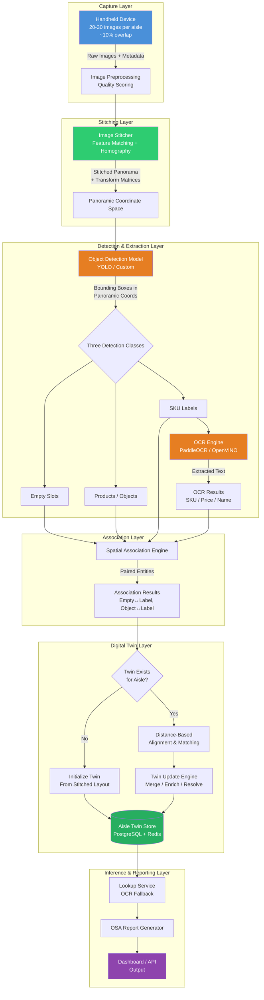
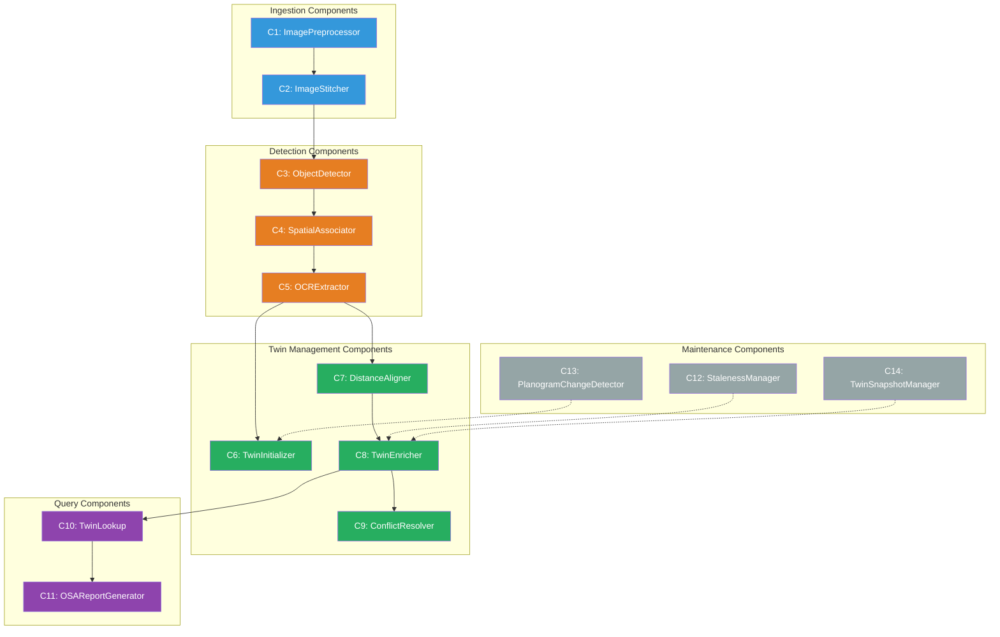
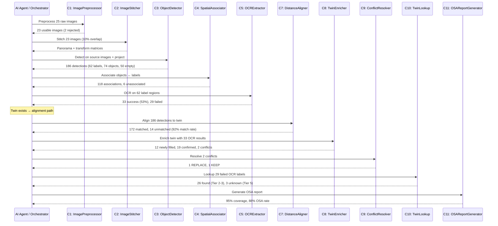
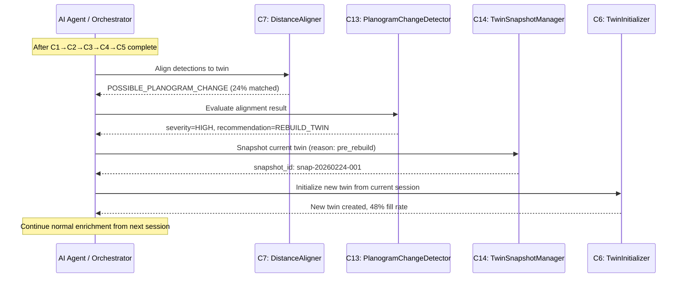
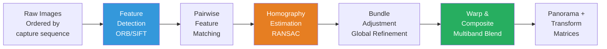
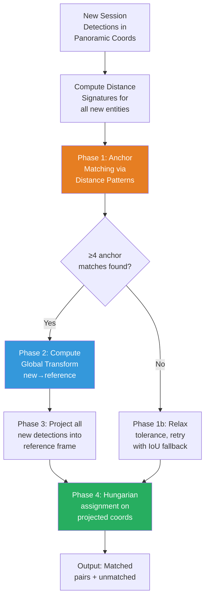

# On-Shelf Availability (OSA) Digital Twin System for Retail

**Version:** 2.0  
**Date:** February 2026  
**Status:** Technical Design Document  

---

## Table of Contents

1. [Executive Summary](#1-executive-summary)
2. [System Architecture Overview](#2-system-architecture-overview)
3. [Component-Based Design System](#3-component-based-design-system)
4. [Pipeline Description](#4-pipeline-description)
5. [Image Stitching & Panoramic Assembly](#5-image-stitching--panoramic-assembly)
6. [Digital Twin Design](#6-digital-twin-design)
7. [Coordinate Alignment & Distance-Based Matching](#7-coordinate-alignment--distance-based-matching)
8. [Incremental Enrichment Strategy](#8-incremental-enrichment-strategy)
9. [Fallback & Lookup Mechanism](#9-fallback--lookup-mechanism)
10. [Data Schema & Storage](#10-data-schema--storage)
11. [Challenges & Mitigations](#11-challenges--mitigations)
12. [Success Metrics & KPIs](#12-success-metrics--kpis)
13. [Implementation Roadmap](#13-implementation-roadmap)

---

## 1. Executive Summary

### Problem

Retail on-shelf availability (OSA) monitoring depends on accurately identifying which products are present, missing, or misplaced on store shelves. Current systems use handheld devices to capture aisle images, which are processed through an object detection and OCR pipeline to identify empty slots, products, and their associated SKU labels. However, the inherent challenges of handheld image capture — motion blur, inconsistent lighting, oblique camera angles, and varying distances — mean that OCR can only successfully extract text from approximately **50% of SKU labels** in any single capture session. This creates a persistent blind spot: the system detects that a label exists but cannot read what it says for half the shelf.

### Solution

The **Aisle Digital Twin** is a persistent, coordinate-faithful spatial replica of each store aisle, built by **stitching 20–30 overlapping images** into a single panoramic mosaic and then populating that unified coordinate space with all detected entities (SKU labels, products, empty slots) at their exact bounding box positions. Unlike a uniform grid with fixed rows and columns, the twin preserves real-world gaps, varying label widths, irregular spacing, and non-uniform shelf geometry.

On the first capture, the stitched panorama establishes the aisle's master coordinate frame. Object detection runs on each source image, and results are projected into the panoramic coordinate space. Roughly 50% of SKU labels are populated with successfully extracted OCR text. On subsequent captures, a new panorama is stitched and the system matches entities to their stored reference positions using **inter-SKU distance patterns** — the unique spatial fingerprint of gaps and distances between neighboring labels that remains stable even when camera angle or position shifts. Over a typical one-week enrichment window, coverage converges toward 90–100%.

Once sufficiently populated, the twin acts as a **real-time lookup layer**: if OCR fails on a label during a new capture, the system retrieves the known SKU data from the twin based on the label's position in the stitched panorama, matched to the reference twin via distance-based alignment. This eliminates the dependency on per-session OCR quality and enables reliable, high-coverage OSA reporting from day one of full twin maturity.

### Business Value

| Dimension | Impact |
|-----------|--------|
| **OSA Accuracy** | From ~50% SKU identification per session to 90–100% after twin maturation |
| **Operational Efficiency** | No need for perfect image quality on every visit; the system self-heals over time |
| **Reduced Re-capture** | Associates no longer need to re-photograph aisles for missed labels |
| **Planogram Compliance** | Full twin enables position-aware compliance checks against expected planograms |
| **Scalability** | Twin-per-aisle architecture scales to hundreds of stores with independent maturation timelines |

---

## 2. System Architecture Overview

### High-Level Architecture



---

## 3. Component-Based Design System

The system is decomposed into **self-contained, stateless components** with well-defined inputs, outputs, and contracts. Each component is designed to be independently invocable by an AI agent or orchestrator. An agent receives a task, selects the appropriate component(s), chains their inputs/outputs, and executes the workflow.

### Design Principles

1. **Single Responsibility**: Each component does exactly one thing. An agent composes them to solve complex tasks.
2. **Stateless Execution**: Components receive all required context via input — no hidden state. Persistence is handled by dedicated storage components.
3. **Typed Contracts**: Every component has a strict input/output schema. An agent can introspect the schema to understand what to pass and what to expect.
4. **Idempotent Operations**: Re-running a component with the same input produces the same output. Safe for retries.
5. **Observable**: Every component emits structured logs and metrics. An agent can inspect results to decide next steps.

### Component Registry



---

### C1: ImagePreprocessor

**Purpose:** Validate, normalize, and quality-score each raw capture image before stitching.

| | Specification |
|---|---|
| **Input** | `{ images: [{ image_bytes, capture_metadata }] }` |
| **Output** | `{ processed_images: [{ image_bytes, quality_score, blur_score, exposure_score, is_usable }] }` |
| **Config** | `min_quality_threshold: 0.3`, `target_exposure_range: [0.3, 0.85]` |
| **Failure Modes** | `IMAGE_CORRUPT`, `BELOW_QUALITY_THRESHOLD`, `INSUFFICIENT_IMAGES` (< 15) |
| **Idempotent** | Yes |

```json
// Example output for a single image
{
  "image_id": "img-017",
  "quality_score": 0.72,
  "blur_score": 0.18,
  "exposure_score": 0.81,
  "is_usable": true,
  "warnings": []
}
```

**Agent usage:** An agent calls C1 first for every capture session. If `is_usable` count < 15, agent can emit a re-capture request to the device layer. Otherwise, pass `processed_images` to C2.

---

### C2: ImageStitcher

**Purpose:** Stitch 20–30 overlapping images (~10% overlap) into a single panoramic mosaic. Output the panorama and per-image homography matrices for coordinate projection.

| | Specification |
|---|---|
| **Input** | `{ processed_images: [{ image_bytes, capture_metadata }], overlap_pct: 0.10 }` |
| **Output** | `{ panorama_bytes, panorama_dimensions: {w, h}, transform_matrices: [H_3x3 per image], stitch_quality_score, seam_map }` |
| **Config** | `feature_detector: "ORB"`, `match_ratio_threshold: 0.75`, `ransac_reproj_threshold: 5.0`, `blend_mode: "multiband"` |
| **Failure Modes** | `INSUFFICIENT_OVERLAP` (< 5% detected), `FEATURE_MATCH_FAILURE`, `HOMOGRAPHY_DEGENERATE` |
| **Idempotent** | Yes |

**Key detail — Transform Matrices:** For each source image `i`, a 3×3 homography matrix `H_i` is produced such that any pixel coordinate `(x, y)` in image `i` can be projected to panoramic coordinates:

```
[px_pano]       [x_img]
[py_pano] = H_i [y_img]
[  1    ]       [  1  ]
```

These matrices are used by downstream components (C3, C5) to project per-image detection results into the unified panoramic coordinate space.

**Agent usage:** Agent passes C1 output to C2. On `INSUFFICIENT_OVERLAP`, agent can request selective re-capture of the gap region. On success, the `panorama_bytes` and `transform_matrices` flow to C3.

---

### C3: ObjectDetector

**Purpose:** Run object detection on the stitched panorama (or on individual source images, with results projected to panoramic coordinates via transform matrices). Detect three classes: `empty_slot`, `object`, `sku_label`.

| | Specification |
|---|---|
| **Input** | `{ panorama_bytes, transform_matrices, source_images (optional for higher-res detection) }` |
| **Output** | `{ detections: [{ entity_id, class, bbox_pano: [x1,y1,x2,y2], confidence, source_image_id }] }` |
| **Config** | `model_path`, `confidence_threshold: 0.50`, `nms_iou_threshold: 0.45`, `run_on: "panorama" | "source_images"` |
| **Failure Modes** | `MODEL_LOAD_ERROR`, `NO_DETECTIONS`, `PANORAMA_TOO_LARGE` |
| **Idempotent** | Yes |

**Detection modes:**

- **Panorama mode** (`run_on: "panorama"`): Run detection once on the full stitched panorama. Simpler, but may lose detail for very long aisles.
- **Source image mode** (`run_on: "source_images"`): Run detection on each original image at full resolution, then project all bounding boxes into panoramic coordinates via `transform_matrices`. Apply cross-image NMS to deduplicate detections in overlap regions. Higher accuracy; recommended default.

```
// In source_image mode, for each detection in image i:
bbox_pano = project_bbox(bbox_img, H_i)

// Then across all images:
detections_deduped = cross_image_nms(all_projected_detections, iou_threshold=0.45)
```

**Agent usage:** Agent selects detection mode based on aisle length. For aisles > 40ft, use `source_images` mode for resolution preservation.

---

### C4: SpatialAssociator

**Purpose:** Link detected entities — pair each `object` and `empty_slot` with its nearest `sku_label` using vertical proximity and horizontal overlap heuristics, all operating in panoramic coordinates.

| | Specification |
|---|---|
| **Input** | `{ detections: [{ entity_id, class, bbox_pano }] }` |
| **Output** | `{ associations: [{ entity_id, entity_class, label_entity_id, association_confidence }], unassociated: [entity_id] }` |
| **Config** | `max_vertical_distance_px: 120`, `min_horizontal_overlap_ratio: 0.30`, `association_strategy: "nearest_below"` |
| **Failure Modes** | `NO_LABELS_DETECTED`, `HIGH_UNASSOCIATED_RATIO` (> 30%) |
| **Idempotent** | Yes |

**Association logic in panoramic space:**

```
For each object/empty_slot O:
  1. Find all sku_labels L where L.y_min > O.y_max (label is below)
     AND (L.y_min - O.y_max) < max_vertical_distance_px
  2. Among candidates, compute horizontal overlap ratio:
     overlap = max(0, min(O.x2, L.x2) - max(O.x1, L.x1)) / min(O.width, L.width)
  3. Select L with highest overlap if overlap ≥ min_horizontal_overlap_ratio
  4. One-to-one assignment: each label can only be claimed once (highest confidence wins)
```

**Agent usage:** Agent passes C3 output directly. If `HIGH_UNASSOCIATED_RATIO`, agent may re-run C3 with lower confidence threshold or flag for investigation.

---

### C5: OCRExtractor

**Purpose:** Extract text (SKU number, price, item name) from each detected SKU label region. Crops from source images (not panorama) for maximum resolution, using inverse transform matrices.

| | Specification |
|---|---|
| **Input** | `{ label_detections: [{ entity_id, bbox_pano }], source_images, transform_matrices }` |
| **Output** | `{ ocr_results: [{ entity_id, sku_number, sku_conf, price, price_conf, item_name, name_conf, overall_conf, ocr_success }] }` |
| **Config** | `ocr_engine: "paddleocr"`, `success_threshold: 0.70`, `crop_padding_px: 5` |
| **Failure Modes** | `OCR_ENGINE_ERROR`, `NO_TEXT_DETECTED` |
| **Idempotent** | Yes |

**Resolution preservation strategy:** Rather than cropping from the (potentially lower-resolution) stitched panorama, C5 reverse-projects each label's panoramic bounding box back to the best source image using inverse homographies, and crops from the original full-resolution image:

```
For each label with bbox_pano:
  1. For each source image i, compute bbox_img_i = inverse_project(bbox_pano, H_i)
  2. Select the source image where the label is most centered (farthest from edges)
  3. Crop label region from that source image at full resolution
  4. Run OCR on the cropped region
```

**Agent usage:** Agent passes C3 label detections + C2 source materials. A label is `ocr_success: true` if `overall_conf ≥ success_threshold`. Agent uses this flag to decide whether to enrich the twin or trigger lookup.

---

### C6: TwinInitializer

**Purpose:** Create a new Digital Twin for an aisle from the first capture session's stitched results. Stores all entities at their panoramic bounding box coordinates.

| | Specification |
|---|---|
| **Input** | `{ store_id, aisle_id, session_id, panorama_dimensions, detections, associations, ocr_results }` |
| **Output** | `{ twin_id, entity_count, ocr_filled_count, fill_rate, entities_created: [entity_id] }` |
| **Side Effects** | Writes to `twin_entities` table, initializes Redis cache |
| **Config** | `min_detections_to_initialize: 10` |
| **Failure Modes** | `TWIN_ALREADY_EXISTS`, `INSUFFICIENT_DETECTIONS` |
| **Idempotent** | Yes (re-initialize produces same twin if input is same) |

**What gets stored:** Every detection (all three classes) is persisted as a twin entity with its panoramic bounding box as the **reference coordinates**. OCR data is attached to `sku_label` entities where available. The panorama dimensions become the twin's reference frame.

**Agent usage:** Agent calls C6 only when no twin exists for the `(store_id, aisle_id)` pair. Otherwise, agent routes to C7 → C8.

---

### C7: DistanceAligner

**Purpose:** Match entities from a new capture session to existing twin entities using **inter-entity distance pattern matching**. This is the core alignment component.

| | Specification |
|---|---|
| **Input** | `{ twin_id, new_detections: [{ entity_id, class, bbox_pano }], twin_entities: [{ entity_id, class, bbox_ref }] }` |
| **Output** | `{ matches: [{ new_id, twin_id, match_confidence, match_method }], unmatched_new: [entity_id], unmatched_twin: [entity_id], alignment_quality_score }` |
| **Config** | `iou_threshold: 0.40`, `distance_pattern_tolerance: 0.08`, `min_anchor_matches: 4`, `hungarian_assignment: true` |
| **Failure Modes** | `ALIGNMENT_FAILED` (< 50% matched), `POSSIBLE_PLANOGRAM_CHANGE` (< 30% matched) |
| **Idempotent** | Yes |

**Matching strategy — detailed in Section 7.** Key innovation: rather than relying solely on absolute coordinate IoU, C7 computes the **distance signature** between neighboring entities and matches patterns across sessions. See Section 7 for full algorithm.

**Agent usage:** Agent always calls C7 before C8. If `POSSIBLE_PLANOGRAM_CHANGE`, agent routes to C13 instead of C8. If `ALIGNMENT_FAILED`, agent can retry with relaxed tolerances or flag for manual review.

---

### C8: TwinEnricher

**Purpose:** Apply matched OCR results from a new session to update/enrich the twin. Handles confidence-weighted updates and lifecycle state transitions.

| | Specification |
|---|---|
| **Input** | `{ twin_id, matches: [{ new_id, twin_id }], ocr_results: [{ entity_id, sku_number, price, item_name, confidences }] }` |
| **Output** | `{ entities_updated: int, entities_newly_filled: int, conflicts_detected: int, new_fill_rate, conflict_ids: [id] }` |
| **Side Effects** | Updates `twin_entities` table, updates Redis cache, may insert into `ocr_conflicts` |
| **Config** | `min_accept_confidence: 0.60`, `boost_on_confirm: 0.05`, `conflict_delta: 0.15` |
| **Failure Modes** | `TWIN_NOT_FOUND`, `NO_MATCHES_PROVIDED` |
| **Idempotent** | No (state changes on each call — but deterministic given same input + state) |

**Agent usage:** Agent calls C8 with matched pairs from C7 + OCR results from C5. If `conflicts_detected > 0`, agent routes `conflict_ids` to C9.

---

### C9: ConflictResolver

**Purpose:** Resolve OCR conflicts where a new session produces different text than what's stored in the twin for the same entity.

| | Specification |
|---|---|
| **Input** | `{ conflicts: [{ entity_id, field, stored_value, stored_conf, new_value, new_conf, history: [past_values] }] }` |
| **Output** | `{ resolutions: [{ entity_id, field, action: "REPLACE" | "KEEP" | "MANUAL_REVIEW", resolved_value, resolved_conf }] }` |
| **Config** | `confidence_superiority_delta: 0.15`, `consensus_min_sessions: 3`, `prefer_recency: true` |
| **Failure Modes** | None (always produces a resolution, even if `MANUAL_REVIEW`) |
| **Idempotent** | Yes |

**Resolution hierarchy (priority order):**

1. **Clear confidence superiority** (Δ > 0.15) → `REPLACE` with higher-confidence value
2. **Consensus voting** (value seen in 3+ sessions) → `KEEP` consensus value
3. **Recency tiebreak** (similar confidence, no consensus) → `REPLACE` with newer value
4. **Persistent ambiguity** (3+ different values, no consensus) → `MANUAL_REVIEW`

**Agent usage:** Agent passes conflict list from C8. Applies `REPLACE`/`KEEP` resolutions directly. Queues `MANUAL_REVIEW` items for human attention.

---

### C10: TwinLookup

**Purpose:** Given a set of detection coordinates from a new capture, retrieve known SKU data from the twin for entities where OCR failed. This is the live-inference fallback.

| | Specification |
|---|---|
| **Input** | `{ twin_id, failed_labels: [{ entity_id, bbox_pano }], match_results (from C7) }` |
| **Output** | `{ lookups: [{ entity_id, matched_twin_entity_id, sku_number, price, item_name, confidence_tier, source: "twin_lookup", effective_confidence }] }` |
| **Config** | `staleness_window_days: 14`, `confidence_decay_floor: 0.30` |
| **Failure Modes** | `TWIN_NOT_FOUND`, `NO_MATCHES_FOR_FAILED_LABELS` |
| **Idempotent** | Yes |

**Confidence tiers applied:**

| Entity Status | Tier | Effective Confidence |
|---------------|------|---------------------|
| CONFIRMED, fresh | Tier 2 | stored_conf (no decay) |
| CONFIRMED, aging | Tier 2–3 | stored_conf × decay_factor |
| PROVISIONAL | Tier 3 | stored_conf |
| STALE | Tier 4 | stored_conf × 0.30 |
| EMPTY | Tier 5 | N/A — no data |

**Agent usage:** Agent calls C10 for any labels where C5 returned `ocr_success: false`. Agent combines C5 successes (Tier 1) + C10 lookups (Tier 2–5) into the full result set and passes to C11.

---

### C11: OSAReportGenerator

**Purpose:** Produce the final on-shelf availability report by combining direct OCR results and twin lookups into a unified view of the aisle.

| | Specification |
|---|---|
| **Input** | `{ store_id, aisle_id, session_id, direct_ocr_results (from C5), twin_lookups (from C10), associations (from C4) }` |
| **Output** | `{ report: { aisle_summary, shelf_status: [{ position, sku, price, name, status: "present" | "empty" | "unknown", data_source, confidence_tier }], fill_rate, osa_rate, coverage_rate, re_capture_targets: [entity_id] } }` |
| **Config** | `min_report_confidence: 0.50` |
| **Failure Modes** | None (always produces a report, even if sparse) |
| **Idempotent** | Yes |

**Agent usage:** Agent calls C11 as the final step of any capture-processing workflow. Output goes to dashboard/API.

---

### C12: StalenessManager

**Purpose:** Periodic maintenance component that scans twin entities for staleness and applies confidence decay.

| | Specification |
|---|---|
| **Input** | `{ twin_id }` or `{ store_id }` (batch mode) |
| **Output** | `{ entities_decayed: int, entities_marked_stale: int, entities_still_fresh: int }` |
| **Side Effects** | Updates entity status and effective_confidence in DB + cache |
| **Config** | `staleness_window_days: 14`, `price_staleness_window_days: 7`, `decay_floor: 0.30` |
| **Schedule** | Runs nightly or on-demand |
| **Idempotent** | Yes |

**Agent usage:** Agent can invoke on a schedule (cron-style) or reactively when a store hasn't been captured in > 7 days.

---

### C13: PlanogramChangeDetector

**Purpose:** Detect potential planogram resets or major shelf reorganizations based on alignment anomalies.

| | Specification |
|---|---|
| **Input** | `{ alignment_result (from C7), twin_entity_count }` |
| **Output** | `{ change_detected: bool, severity: "NONE" | "LOW" | "HIGH", unmatched_ratio, new_position_ratio, recommendation: "PROCEED" | "FREEZE_AND_REVIEW" | "REBUILD_TWIN" }` |
| **Config** | `unmatched_threshold: 0.30`, `new_position_threshold: 0.20` |
| **Failure Modes** | None |
| **Idempotent** | Yes |

**Agent usage:** Agent calls C13 whenever C7 returns `POSSIBLE_PLANOGRAM_CHANGE` or `ALIGNMENT_FAILED`. Based on `recommendation`:
- `PROCEED` → Continue to C8
- `FREEZE_AND_REVIEW` → Skip C8, alert human operator
- `REBUILD_TWIN` → Agent calls C14 to snapshot old twin, then C6 to initialize a fresh twin

---

### C14: TwinSnapshotManager

**Purpose:** Create, list, and restore point-in-time snapshots of a twin for auditing and rollback.

| | Specification |
|---|---|
| **Input (create)** | `{ twin_id, reason: "pre_rebuild" | "scheduled" | "manual" }` |
| **Input (restore)** | `{ twin_id, snapshot_id }` |
| **Output (create)** | `{ snapshot_id, entity_count, timestamp }` |
| **Output (restore)** | `{ restored_entity_count, previous_snapshot_archived: bool }` |
| **Side Effects** | Writes/reads from object storage (S3) |
| **Idempotent** | Yes (create) / No (restore) |

**Agent usage:** Agent calls snapshot before any destructive operation (planogram rebuild, manual purge).

---

### Agent Workflow Orchestration

The following shows how an AI agent composes these components for the two primary workflows:

#### Workflow 1: Standard Capture Processing



#### Workflow 2: Planogram Change Handling



---

## 4. Pipeline Description

The end-to-end pipeline is a **seven-stage process** from image capture to actionable OSA output. The key addition compared to single-image systems is **Stage 2: Image Stitching**, which produces a unified panoramic coordinate space before any detection or OCR occurs.

### Stage 1: Image Capture

A store associate walks an aisle with a handheld device, capturing **20–30 images with approximately 10% overlap** between consecutive frames. The associate walks at a steady pace, holding the device at roughly shelf height. Each image covers a portion of the aisle; together, they span the full aisle length.

| Field | Example | Purpose |
|-------|---------|---------|
| `store_id` | `STR-0042` | Identifies the store location |
| `aisle_id` | `A07` | Identifies the specific aisle |
| `capture_session_id` | `sess-20260224-001` | Groups images from a single walk-through |
| `image_sequence_num` | `14` (of 25) | Ordering for stitching |
| `timestamp` | `2026-02-24T14:32:00Z` | Temporal ordering |
| `image_quality_score` | `0.72` | Auto-computed blur/exposure score |

**Why 10% overlap?** This is the minimum viable overlap for reliable feature matching during stitching. Higher overlap (20–30%) improves stitch quality but increases capture time and storage. 10% is the practical floor — the stitcher (C2) will flag if actual overlap is below ~5%.

### Stage 2: Image Stitching (NEW — see Section 5 for full detail)

The 20–30 images are stitched into a **single panoramic mosaic** using feature-based homography estimation. This produces:

1. **A panoramic image** — the unified visual representation of the entire aisle
2. **Per-image transform matrices** — 3×3 homography matrices mapping each source image's pixel space to the panoramic coordinate space
3. **A stitch quality score** — measuring seam alignment, ghosting, and coverage completeness

The panoramic coordinate space becomes the **canonical reference frame** for all downstream processing. Every detection, association, and twin entity is expressed in panoramic pixel coordinates.

```
Source Images (20-30)                    Stitched Panorama
┌──────┐ ┌──────┐ ┌──────┐              ┌────────────────────────────────────────┐
│ IMG  │ │ IMG  │ │ IMG  │              │                                        │
│  01  │→│  02  │→│  03  │→ ... →       │   Full Aisle Panoramic Mosaic          │
│      │ │      │ │      │              │   (unified coordinate space)           │
│ 10%  │ │ 10%  │ │ 10%  │              │   W: ~15000-25000 px                   │
│overlap│ │overlap│ │overlap│             │   H: ~2000-4000 px                     │
└──────┘ └──────┘ └──────┘              └────────────────────────────────────────┘
                                         + H_1, H_2, H_3 ... H_n (transform matrices)
```

### Stage 3: Object Detection

The object detection model produces bounding boxes for three classes. Detection can run in two modes:

- **Panorama mode**: Run once on the full stitched image. Fast but may lose detail at extremes of very long panoramas.
- **Source image mode** (recommended): Run detection on each original high-resolution image, then project all bounding boxes into panoramic coordinates using the transform matrices. Cross-image NMS deduplicates detections in overlap regions.

Each detection is expressed in panoramic coordinates: `[x_min, y_min, x_max, y_max]` in the panorama's pixel space.

### Stage 4: Spatial Association

The association engine pairs detected entities using vertical proximity and horizontal overlap heuristics, all operating in the unified panoramic coordinate space. Because coordinates are now in a single frame (not per-image), associations that span image boundaries are handled naturally.

### Stage 5: OCR Extraction

Each SKU label region is reverse-projected from panoramic coordinates back to the best source image for maximum resolution cropping. The OCR engine extracts SKU number, price, and item name with per-field confidence scores. ~50% of labels meet the success threshold.

### Stage 6: Twin Update (Digital Twin Enrichment)

Successfully extracted label data is matched to the aisle's existing Digital Twin (or used to initialize a new twin). The matching operates on **panoramic coordinates** and uses **inter-entity distance patterns** as the primary alignment signal. See Sections 7–8.

### Stage 7: Lookup & Reporting

For labels where OCR fails, the system queries the Digital Twin by spatial position to retrieve previously stored SKU data. The combined results (direct OCR + twin lookup) feed into the OSA report.

---

## 5. Image Stitching & Panoramic Assembly

### Overview

Image stitching transforms 20–30 discrete captures into a single, seamless panoramic representation of the entire aisle. This panorama becomes the canonical coordinate space for the Digital Twin — all entity positions are defined relative to it.

### Stitching Pipeline



### Step-by-Step Process

**Step 1 — Feature Detection:**
Extract keypoints and descriptors from each image using ORB (fast, rotation-invariant) or SIFT (more robust but slower). Typical yield: 2000–5000 keypoints per image.

**Step 2 — Pairwise Feature Matching:**
Match features between consecutive image pairs (image `i` and image `i+1`). With 10% overlap, the overlapping strip contains a subset of shared features. Use ratio test (Lowe's ratio = 0.75) to filter spurious matches. Minimum 30 inlier matches required per pair.

**Step 3 — Homography Estimation:**
For each image pair, compute a 3×3 homography matrix using RANSAC to handle outliers. This matrix defines how image `i+1` warps to align with image `i`.

**Step 4 — Bundle Adjustment:**
Chain individual pairwise homographies into global transforms relative to a reference image (typically the center image of the sequence, to minimize cumulative warp distortion). Apply bundle adjustment to minimize reprojection error across all images simultaneously, correcting drift accumulated over 20–30 sequential transforms.

**Step 5 — Warp & Composite:**
Warp each source image into the panoramic canvas using its global transform matrix. Use multiband blending to smooth seams and handle exposure differences between frames.

**Step 6 — Output:**
Produce the final panorama and store the per-image transform matrices for downstream use.

### Transform Matrix Usage

The per-image homography matrices `H_1, H_2, ..., H_n` are the critical bridge between source images and the panoramic coordinate space:

```
┌─────────────────────────────────────────────────────────┐
│   How coordinates flow through the system                │
│                                                         │
│   Source Image i                                        │
│   ┌─────────────┐     H_i (forward)                    │
│   │ Detection at │ ─────────────────→ Panoramic coords  │
│   │ (x=120,      │                    (px=3842,          │
│   │  y=340)      │                     py=340)           │
│   └─────────────┘                                       │
│                        H_i⁻¹ (inverse)                  │
│   Source Image i  ←───────────────── Panoramic coords    │
│   (for OCR crop)                     (for label lookup)  │
│                                                         │
│   Panoramic coords are ALSO the twin's reference frame   │
│   → positions stored in twin_entities use panoramic px   │
└─────────────────────────────────────────────────────────┘
```

### Handling Stitching Challenges

| Challenge | Mitigation |
|-----------|-----------|
| **Insufficient overlap** (< 5%) | C2 returns `INSUFFICIENT_OVERLAP` error. Agent requests targeted re-capture of gap region. |
| **Exposure variation** between frames | Multiband blending + histogram equalization during preprocessing (C1). |
| **Parallax from close-range objects** | Shelf images are roughly planar (products at similar depth), minimizing parallax. For end-cap aisles with depth variance, use cylindrical projection. |
| **Motion blur in individual frames** | C1 flags low-quality frames. Stitcher can exclude them if sufficient neighboring frames exist; detections still run on non-blurred frames. |
| **Cumulative drift over 25+ images** | Bundle adjustment (Step 4) corrects global drift. Center-referenced transforms minimize edge distortion. |

### Panorama as Reference Frame

The first session's panorama establishes the **master reference frame** for the aisle's Digital Twin. All entity positions are stored in this frame's pixel coordinates. On subsequent sessions, the new panorama is aligned to the reference frame (see Section 7) so that coordinates remain comparable across time.

---

## 6. Digital Twin Design

### Conceptual Model — Coordinate-Faithful Spatial Replica

The Digital Twin is **not** a uniform rectangular matrix with fixed rows and columns. It is a **coordinate-faithful spatial replica** of the physical aisle — an irregularly spaced collection of entities (SKU labels, objects, empty slots) where each entity is stored at the exact bounding box coordinates from the stitched panoramic mosaic. The gaps between labels, the varying widths of product facings, the irregular spacing between shelves — all are preserved. The result is a spatial map that, if rendered, would look like a wireframe overlay of the actual stitched aisle photograph.

Each entity in the twin is defined by its **full bounding box** in panoramic pixel coordinates (`x_min, y_min, x_max, y_max`). There is no assumption of uniform cell size, equal column spacing, or aligned rows.

```
Aisle A07 — Digital Twin (rendered from stitched panorama coordinates)
Panorama width: 18400px | Height: 3200px
┌──────────────────────────────────────────────────────────────────────────────────────┐
│ px 0                    4000                    8000                    12000        │
│                                                                                      │
│ ┌────────┐    ┌──────────────┐  ┌─────────┐         ┌────────┐  ┌──────────┐        │
│ │ obj    │    │ EMPTY SLOT   │  │ obj     │         │ obj    │  │ obj      │        │
│ │(82,210 │    │(1240,205→    │  │(2680,   │  ...    │(8420,  │  │(9100,    │  ...   │
│ │→490,   │    │ 1890,580)    │  │ 218→    │  more   │ 212→   │  │ 220→     │        │
│ │ 575)   │    │              │  │ 3050,   │  shelf  │ 8790,  │  │ 9580,    │        │
│ └────────┘    └──────────────┘  │ 572)    │  units  │ 568)   │  │ 577)     │        │
│ ┌──────┐       ┌────────┐      └─────────┘         └────────┘  └──────────┘        │
│ │LABEL │       │ LABEL  │      ┌──────┐             ┌──────┐    ┌────────┐          │
│ │$3.99 │       │ ???    │      │LABEL │             │$2.49 │    │ LABEL  │          │
│ │Cereal│       │OCR FAIL│      │$5.99 │             │Chips │    │ ???    │          │
│ │(85,  │       │(1248,  │      │Gran. │             │(8425,│    │OCR FAIL│          │
│ │580→  │       │585→    │      │(2690,│             │575→  │    │(9108,  │          │
│ │482,  │       │1878,   │      │578→  │             │8782, │    │580→    │          │
│ │652)  │       │648)    │      │3040, │             │643)  │    │9572,   │          │
│ └──────┘       └────────┘      │648)  │             └──────┘    │648)    │          │
│    ↕                           └──────┘                         └────────┘          │
│  ← 1155px gap →                                                                     │
│                 ← 792px gap →                                                        │
│                                                                                      │
│  Coordinates are panoramic pixels. Gaps and sizes reflect real physical layout.       │
└──────────────────────────────────────────────────────────────────────────────────────┘
         Entity count: 186 | OCR-filled labels: 33/62 = 53%
```

### Why Not a Uniform Grid?

| Assumption of Uniform Grid | Reality on Shelf |
|----------------------------|------------------|
| All labels are the same width | Labels vary by product category (e.g., 2-facing vs. 1-facing) |
| Labels are evenly spaced horizontally | Gaps vary — some products are flush, others have 2–3 inch gaps |
| Shelf rows are perfectly horizontal | Shelf strips bend, droop, or mount at slightly different heights |
| Every row has the same number of positions | Different shelves hold different product counts |
| Objects and labels are vertically aligned in neat columns | Products are staggered; labels don't form a strict column grid |

### Entity Types in the Twin

| Entity Type | Detection Class | Role in Twin | OCR Applicable? |
|-------------|----------------|--------------|-----------------|
| **SKU Label** | `sku_label` | Primary anchor — carries OCR data (SKU number, price, item name) | Yes |
| **Object (Product)** | `object` | Indicates product presence; associated with its nearest SKU label | No |
| **Empty Slot** | `empty_slot` | Indicates product absence; associated with its nearest SKU label | No |

### Coordinate System

All coordinates are in **panoramic pixel space** — the coordinate frame produced by the stitcher (C2).

```
bbox_pano: [x_min, y_min, x_max, y_max]   — panoramic pixel coordinates

Derived:
  centroid_x = (x_min + x_max) / 2
  centroid_y = (y_min + y_max) / 2
  width      = x_max - x_min
  height     = y_max - y_min
```

**Cross-session alignment** does not require normalization to `[0, 1]` because matching is done via inter-entity distance patterns (Section 7), which are scale-invariant. The raw panoramic pixel coordinates are sufficient.

### Entity Record Schema

```json
{
  "entity_id": "A07-e0042",
  "store_id": "STR-0042",
  "aisle_id": "A07",
  "entity_type": "sku_label",

  "bbox_pano": [2690, 578, 3040, 648],
  "centroid": [2865, 613],
  "width": 350,
  "height": 70,

  "associated_object_id": "A07-e0041",
  "associated_empty_slot_id": null,

  "sku_number": "00491820034",
  "sku_confidence": 0.92,
  "price": "$5.99",
  "price_confidence": 0.88,
  "item_name": "Granola Oats 14oz",
  "name_confidence": 0.71,
  "overall_confidence": 0.84,

  "distance_signature": {
    "left_neighbor_id": "A07-e0038",
    "left_gap_px": 792,
    "right_neighbor_id": "A07-e0045",
    "right_gap_px": 1155,
    "above_neighbor_id": "A07-e0041",
    "above_gap_px": 6
  },

  "first_seen_session": "sess-20260217-001",
  "last_updated_session": "sess-20260222-003",
  "last_updated_at": "2026-02-22T09:15:00Z",
  "update_count": 4,
  "status": "CONFIRMED"
}
```

**Key addition — `distance_signature`:** Each entity stores the pixel distances to its nearest neighbors in each direction. This signature is the primary matching signal across sessions (see Section 7).

### Persistence Layer

| Layer | Technology | Purpose |
|-------|-----------|---------|
| **Primary Store** | PostgreSQL with PostGIS | Persistent entity storage with spatial bounding box indexing |
| **Cache** | Redis | Hot-path lookup during inference (per-aisle entities cached with spatial sorted sets) |
| **Archive** | Object storage (S3) | Historical twin snapshots, stitched panoramas for auditing |

---

## 7. Coordinate Alignment & Distance-Based Matching

### The Core Problem

When a new capture session is stitched into a panorama, the resulting coordinate space will differ from the reference twin's panoramic coordinates — the associate held the device at a different height, started from a slightly different position, or walked at a different speed. Raw pixel coordinates are not directly comparable. The system needs a matching strategy that is **invariant to global translation, scale, and moderate perspective shift**.

### The Key Insight: Inter-SKU Distance Patterns

While absolute positions shift between sessions, the **relative distances between neighboring entities are physically fixed** (they're bolted to a shelf). If label A is 792px from label B and 1155px from label C in the reference twin, and in a new capture there are three labels with the same distance ratios, that's a strong match — regardless of where they appear in absolute panoramic coordinates.

```
Reference Twin (Session 1 panorama):
   Label_12        Label_13           Label_14
   ┌──────┐        ┌──────┐           ┌──────┐
   │      │←792px→ │      │←1155px →  │      │
   └──────┘        └──────┘           └──────┘

New Capture (Session 5 panorama — different starting position, slight scale shift):
   Label_A         Label_B            Label_C
   ┌──────┐        ┌──────┐           ┌──────┐
   │      │←806px→ │      │←1174px →  │      │
   └──────┘        └──────┘           └──────┘

Distance ratios:
  Reference: 792 / 1155 = 0.686
  New:       806 / 1174 = 0.687
  
  → Ratio match within tolerance → Label_A=Label_12, B=13, C=14
```

### Matching Algorithm (Component C7)



#### Phase 1: Anchor Matching via Distance Patterns

For each entity in the new capture, compute its **distance signature** — the distances to its K nearest same-class neighbors (default K=4):

```python
def compute_distance_signature(entity, all_entities, k=4):
    """
    Compute distances to K nearest same-class neighbors.
    Returns sorted list of (neighbor_id, distance, direction_angle).
    """
    same_class = [e for e in all_entities if e.class == entity.class and e.id != entity.id]
    distances = []
    for neighbor in same_class:
        dx = neighbor.centroid_x - entity.centroid_x
        dy = neighbor.centroid_y - entity.centroid_y
        dist = sqrt(dx**2 + dy**2)
        angle = atan2(dy, dx)  # preserves relative direction
        distances.append((neighbor.id, dist, angle))
    return sorted(distances, key=lambda x: x[1])[:k]
```

Then match signatures between new entities and reference twin entities:

```python
def match_distance_signatures(new_sig, ref_sig, distance_tolerance=0.08):
    """
    Compare two distance signatures. Tolerance is relative (8% of distance).
    Returns match score (0.0 = no match, 1.0 = perfect match).
    """
    if len(new_sig) != len(ref_sig):
        return 0.0
    
    score = 0.0
    for (_, d_new, a_new), (_, d_ref, a_ref) in zip(new_sig, ref_sig):
        # Distance ratio check
        if d_ref == 0:
            continue
        ratio_diff = abs(d_new - d_ref) / d_ref
        if ratio_diff > distance_tolerance:
            return 0.0  # Hard fail on any neighbor mismatch
        
        # Angle consistency check (within 15°)
        angle_diff = abs(a_new - a_ref) % (2 * pi)
        if angle_diff > radians(15):
            return 0.0
        
        score += (1.0 - ratio_diff) * (1.0 - angle_diff / radians(15))
    
    return score / len(new_sig)
```

The top-scoring matches (score > 0.8) with mutual best-match consistency become **anchor pairs**.

#### Phase 2: Global Transform Estimation

Using the anchor pairs (minimum 4 required), compute a **similarity transform** (translation + rotation + uniform scale) that maps the new panorama's coordinates to the reference frame:

```
T = estimate_similarity_transform(
    src_points = [anchor.new_centroid for anchor in anchors],
    dst_points = [anchor.ref_centroid for anchor in anchors]
)

# T is a 2×3 affine matrix: [s*cos(θ), -s*sin(θ), tx]
#                             [s*sin(θ),  s*cos(θ), ty]
```

A similarity transform (not a full homography) is used because the aisle shelf is approximately planar, and the dominant differences between sessions are translation, rotation, and scale — not complex perspective distortion.

#### Phase 3: Project New Detections

Apply `T` to transform all new detection coordinates into the reference twin's coordinate frame:

```
For each new detection:
    centroid_ref = T @ centroid_new
    bbox_ref = transform_bbox(bbox_new, T)
```

#### Phase 4: Hungarian Assignment

With all detections now in the same coordinate frame, compute IoU between each transformed new detection and each reference twin entity. Use the **Hungarian algorithm** to find the optimal one-to-one assignment that maximizes total IoU:

```
cost_matrix[i][j] = 1.0 - IoU(new_detection_i_transformed, twin_entity_j)

assignment = hungarian(cost_matrix)

For each (i, j) in assignment:
    if IoU(i, j) ≥ 0.40:
        match(new_detection_i, twin_entity_j)
    else:
        unmatched
```

### Why Distance Patterns Work

| Property | Benefit |
|----------|---------|
| **Translation invariant** | Distances don't change when the panorama shifts |
| **Scale invariant** (via ratios) | Slightly different camera distances produce proportional scaling, but ratios hold |
| **Rotation invariant** (via angles) | Tilted captures produce rotated panoramas, but relative angles between neighbors are preserved |
| **Robust to partial visibility** | Even if only 60% of the aisle is visible in a new capture, the visible portion's distance pattern still matches |
| **Physically grounded** | Labels are physically attached to shelves — their inter-label distances change only on planogram resets |

---

## 8. Incremental Enrichment Strategy

### Day-Over-Day Accumulation

The twin converges toward full coverage over multiple capture sessions:

| Session | New Labels Read | Cumulative Readable | Twin Fill Rate |
|---------|----------------|--------------------:|---------------:|
| Day 1 (Session 1) | 50% of labels | 50% | **50%** |
| Day 2 (Session 2) | 50% of labels | ~75% (some overlap) | **~75%** |
| Day 3 (Session 3) | 50% of labels | ~87% | **~87%** |
| Day 5 (Session 5) | 50% of labels | ~97% | **~97%** |
| Day 7 (Session 7) | — | ~99% | **~99%** |

### Confidence Scoring

Each OCR extraction carries per-field confidence scores. The twin uses a **weighted confidence accumulation** model:

```
For each field (sku_number, price, item_name):

  If entity field is EMPTY:
      Accept new value if confidence ≥ min_threshold (0.60)
      Store value and confidence

  If entity field is POPULATED:
      If new_confidence > stored_confidence:
          Replace value and confidence
      If new_value == stored_value:
          Boost confidence: new_conf = min(1.0, stored_conf + 0.05)
      If new_value != stored_value AND new_confidence > stored_confidence:
          Route to ConflictResolver (C9)
```

### Conflict Resolution

Handled by Component C9. See its specification in Section 3 for the full resolution hierarchy.

### Enrichment Lifecycle

A `sku_label` entity transitions through the following lifecycle states:

```
[EMPTY] → [PROVISIONAL] → [CONFIRMED] → [STALE] → [RE-CONFIRMED / INVALIDATED]

EMPTY:        No OCR data. Entity has bounding box position and distance signature only.
PROVISIONAL:  Single-session OCR read, confidence ≥ 0.60.
CONFIRMED:    Value confirmed by 2+ sessions OR single read with confidence ≥ 0.90.
STALE:        Confirmed entity not re-observed in 14+ days (configurable).
INVALIDATED:  Planogram change detected; entity data cleared for re-population.
```

---

## 9. Fallback & Lookup Mechanism

### Live Inference Flow

Handled by Component C10. When OCR fails on a label, the system uses the C7 alignment result to find the corresponding twin entity and returns its stored data.

### Lookup Confidence Tiers

| Source | Tier | Confidence Range | Usage Guidance |
|--------|------|-----------------|----------------|
| Direct OCR (current session) | **Tier 1** | ≥ 0.70 | Full trust — use directly |
| Twin lookup (CONFIRMED entity) | **Tier 2** | ≥ 0.80 (entity confidence) | High trust — use with "twin-sourced" flag |
| Twin lookup (PROVISIONAL entity) | **Tier 3** | 0.60 – 0.79 | Moderate trust — use with caveat in report |
| Twin lookup (STALE entity) | **Tier 4** | Degraded by staleness | Low trust — flag for re-capture priority |
| No data available | **Tier 5** | N/A | Unknown — queue for targeted re-capture |

### Staleness Handling

```
effective_confidence = stored_confidence × decay_factor

Where:
  decay_factor = max(0.3, 1.0 - (days_since_last_update / staleness_window))
  staleness_window = 14 days (configurable per store/category)
  
Examples:
  0 days stale  → factor = 1.00 → effective = stored
  7 days stale  → factor = 0.50 → effective = stored × 0.50
  14 days stale → factor = 0.30 → effective = stored × 0.30 (floor)
```

When `effective_confidence` drops below 0.50, the entity transitions to `STALE` status.

---

## 10. Data Schema & Storage

### Primary Entity Table: `twin_entities`

```sql
CREATE TABLE twin_entities (
    entity_id           VARCHAR(32) PRIMARY KEY,
    store_id            VARCHAR(16) NOT NULL,
    aisle_id            VARCHAR(8)  NOT NULL,
    entity_type         VARCHAR(16) NOT NULL,       -- 'sku_label', 'object', 'empty_slot'
    
    -- Bounding box in panoramic pixel coordinates
    bbox_x_min          INT         NOT NULL,
    bbox_y_min          INT         NOT NULL,
    bbox_x_max          INT         NOT NULL,
    bbox_y_max          INT         NOT NULL,
    centroid_x          INT         NOT NULL,
    centroid_y          INT         NOT NULL,
    width               INT         NOT NULL,
    height              INT         NOT NULL,
    
    -- Distance signature (JSONB for flexible neighbor list)
    distance_signature  JSONB,
    
    -- Spatial associations
    associated_label_id VARCHAR(32) REFERENCES twin_entities(entity_id),
    
    -- OCR data (only for sku_label entities)
    sku_number          VARCHAR(20),
    sku_confidence      FLOAT       DEFAULT 0.0,
    price               VARCHAR(12),
    price_confidence    FLOAT       DEFAULT 0.0,
    item_name           VARCHAR(128),
    name_confidence     FLOAT       DEFAULT 0.0,
    overall_confidence  FLOAT       DEFAULT 0.0,
    
    -- Lifecycle
    status              VARCHAR(16) NOT NULL DEFAULT 'EMPTY',
    first_seen_session  VARCHAR(32) NOT NULL,
    last_updated_session VARCHAR(32),
    last_updated_at     TIMESTAMPTZ,
    confirmation_count  SMALLINT    DEFAULT 0,
    
    created_at          TIMESTAMPTZ DEFAULT NOW(),
    updated_at          TIMESTAMPTZ DEFAULT NOW()
);

-- Spatial index on bounding boxes
CREATE INDEX idx_twin_spatial ON twin_entities USING GIST (
    box(point(bbox_x_min, bbox_y_min), point(bbox_x_max, bbox_y_max))
);

-- Aisle-level queries
CREATE INDEX idx_twin_aisle ON twin_entities (store_id, aisle_id, entity_type);

-- Status filtering
CREATE INDEX idx_twin_status ON twin_entities (store_id, aisle_id, status);

-- Association lookups
CREATE INDEX idx_twin_assoc ON twin_entities (associated_label_id);

-- Distance signature GIN index for JSONB queries
CREATE INDEX idx_twin_distance ON twin_entities USING GIN (distance_signature);
```

### Panorama Reference Table: `aisle_panoramas`

```sql
CREATE TABLE aisle_panoramas (
    panorama_id         VARCHAR(32) PRIMARY KEY,
    store_id            VARCHAR(16) NOT NULL,
    aisle_id            VARCHAR(8)  NOT NULL,
    session_id          VARCHAR(32) NOT NULL,
    is_reference_frame  BOOLEAN     DEFAULT FALSE,  -- TRUE for the master reference panorama
    panorama_width      INT         NOT NULL,
    panorama_height     INT         NOT NULL,
    source_image_count  SMALLINT    NOT NULL,
    stitch_quality_score FLOAT,
    panorama_storage_url VARCHAR(256),               -- S3 URL for the stitched image
    transform_matrices  JSONB,                       -- Per-image H matrices
    created_at          TIMESTAMPTZ DEFAULT NOW()
);

CREATE INDEX idx_pano_aisle ON aisle_panoramas (store_id, aisle_id, is_reference_frame);
```

### Session Log Table: `capture_sessions`

```sql
CREATE TABLE capture_sessions (
    session_id          VARCHAR(32) PRIMARY KEY,
    store_id            VARCHAR(16) NOT NULL,
    aisle_id            VARCHAR(8)  NOT NULL,
    captured_at         TIMESTAMPTZ NOT NULL,
    image_count         SMALLINT,
    panorama_id         VARCHAR(32) REFERENCES aisle_panoramas(panorama_id),
    total_labels_detected SMALLINT,
    ocr_success_count   SMALLINT,
    ocr_success_rate    FLOAT,
    twin_entities_updated SMALLINT,
    twin_fill_rate_after FLOAT,
    alignment_quality_score FLOAT,
    processing_status   VARCHAR(16) DEFAULT 'PENDING'
);
```

### Conflict Audit Table: `ocr_conflicts`

```sql
CREATE TABLE ocr_conflicts (
    conflict_id         SERIAL PRIMARY KEY,
    entity_id           VARCHAR(32) REFERENCES twin_entities(entity_id),
    field_name          VARCHAR(16),
    stored_value        VARCHAR(128),
    stored_confidence   FLOAT,
    new_value           VARCHAR(128),
    new_confidence      FLOAT,
    resolution          VARCHAR(16),        -- 'REPLACED', 'KEPT', 'MANUAL_REVIEW'
    session_id          VARCHAR(32),
    resolved_at         TIMESTAMPTZ DEFAULT NOW()
);
```

### Redis Cache Structure

```
-- Per-entity data
Key:    entity:{store_id}:{aisle_id}:{entity_id}
Type:   Hash
Fields: type, bbox (JSON), sku, price, name, conf, status, dist_sig (JSON)
TTL:    24 hours (refreshed on each capture session)

-- Spatial indexing via dual sorted sets
Key:    twin_cx:{store_id}:{aisle_id}
Type:   Sorted Set
Score:  centroid_x (panoramic px)
Member: entity_id

Key:    twin_cy:{store_id}:{aisle_id}
Type:   Sorted Set
Score:  centroid_y (panoramic px)
Member: entity_id
```

**Coordinate lookup:** `ZRANGEBYSCORE` on both axes within a tolerance window, then intersect results to find candidate entities for matching.

---

## 11. Challenges & Mitigations

| # | Risk | Severity | Likelihood | Mitigation |
|---|------|----------|------------|------------|
| 1 | **Planogram resets** — Store reshuffles products, invalidating entity positions and distance patterns | High | Medium | C13 detects via mass alignment failure (>30% unmatched). Agent snapshots via C14, rebuilds twin via C6. |
| 2 | **Camera angle variance** — Different associates hold device at different heights/angles | Medium | High | Distance-pattern matching is inherently tolerant to perspective shifts. Bundle adjustment in stitching absorbs moderate distortion. |
| 3 | **Stitching drift** — Accumulated error over 25+ images causes coordinate distortion at panorama edges | Medium | Medium | Bundle adjustment with center-referenced transforms minimizes drift. Quality score from C2 flags problematic stitches. |
| 4 | **Persistent OCR failures** — Some labels are always unreadable (damaged, occluded, reflective) | Medium | High | After 5+ sessions with failed OCR, flag for manual data entry via admin interface. |
| 5 | **Price changes** — Prices update frequently, stale twin shows old prices | High | High | Price field uses shorter staleness window (7 days). C12 applies aggressive decay. |
| 6 | **Insufficient image overlap** — Associate captures images with < 5% overlap, stitching fails | High | Medium | C2 returns `INSUFFICIENT_OVERLAP`. Agent requests targeted re-capture. Mobile app can show overlap guidance UI. |
| 7 | **Scale variance between sessions** — Different distances produce different-scale panoramas | Medium | Medium | Distance-pattern matching uses distance *ratios*, which are scale-invariant. Similarity transform in C7 Phase 2 absorbs global scale. |
| 8 | **Reference frame aging** — The master panorama accumulates alignment error as the shelf ages | Low | Medium | Periodically re-establish reference frame from the best recent stitch. C14 snapshots the old frame first. |

### Planogram Change Detection

Handled by Component C13. Triggers when C7 alignment quality drops below threshold:

```python
def evaluate_alignment(alignment_result, twin_entity_count):
    unmatched_ratio = len(alignment_result.unmatched_new) / alignment_result.total_detections
    
    if unmatched_ratio > 0.30:
        return {"change_detected": True, "severity": "HIGH", "recommendation": "REBUILD_TWIN"}
    elif unmatched_ratio > 0.15:
        return {"change_detected": True, "severity": "LOW", "recommendation": "FREEZE_AND_REVIEW"}
    else:
        return {"change_detected": False, "severity": "NONE", "recommendation": "PROCEED"}
```

---

## 12. Success Metrics & KPIs

### Primary Metrics

| Metric | Definition | Target | Measurement |
|--------|-----------|--------|-------------|
| **Twin Fill Rate** | % of SKU label entities with status ≥ PROVISIONAL | ≥ 90% within 5 sessions | Per aisle, per store |
| **Effective SKU Coverage** | % of detected labels with known SKU data (direct OCR + twin lookup) | ≥ 95% at twin maturity | Per capture session |
| **OSA Accuracy** | Agreement between system-reported shelf status and ground truth audits | ≥ 92% | Weekly audit sampling |
| **Time to Twin Maturity** | Sessions required for twin fill rate to reach 90% | ≤ 5 sessions | Per aisle |
| **Stitch Success Rate** | % of capture sessions that produce a valid panorama | ≥ 95% | Per session |

### Secondary Metrics

| Metric | Definition | Target |
|--------|-----------|--------|
| **Direct OCR Success Rate** | % of labels successfully read per session (no twin assist) | Track trend; expect ~50% |
| **Lookup Utilization Rate** | % of results sourced from twin lookup vs. direct OCR | Expect 30–50% at maturity |
| **Distance Match Rate** | % of entities matched via distance patterns in C7 Phase 1 | ≥ 70% |
| **Alignment Quality Score** | Average C7 alignment quality across sessions | ≥ 0.85 |
| **Conflict Rate** | % of twin updates triggering conflict resolution | < 5% |
| **Staleness Rate** | % of label entities in STALE status at any time | < 10% with regular captures |
| **Planogram Change Detection Rate** | % of actual planogram changes detected automatically | ≥ 85% |
| **Twin Lookup Latency (p99)** | Response time for coordinate-based entity lookup | < 10ms |

### Monitoring Dashboard

- **Twin fill heatmap**: Per-aisle spatial visualization showing entity status at actual bounding box positions overlaid on the reference panorama
- **Coverage convergence curve**: Fill rate over sessions for each aisle
- **Stitch quality timeline**: Stitch quality scores per session, flagging degradation
- **Conflict resolution log**: Filterable view of recent conflicts and their resolutions
- **Staleness alert feed**: Entities approaching or exceeding staleness thresholds
- **Store-level coverage summary**: Aggregate fill rate across all aisles per store

---

## 13. Implementation Roadmap

### Phase 1: Stitching & Foundation (Weeks 1–5)

**Goal:** Image stitching pipeline + twin initialization from a single session.

| Deliverable | Description |
|------------|-------------|
| C1: ImagePreprocessor | Quality scoring, blur detection, exposure normalization |
| C2: ImageStitcher | Feature matching, homography estimation, bundle adjustment, multiband blending |
| C3: ObjectDetector | Source-image-mode detection with panoramic projection and cross-image NMS |
| C6: TwinInitializer | Create twin from stitched panorama detections |
| Database schema | PostgreSQL tables, spatial indices, Redis cache setup |
| Panorama storage | S3 integration for panorama archival |

**Exit criteria:** 25 images are stitched into a panorama, detections are projected into panoramic coordinates, and a twin is initialized with all entities at their exact bounding box positions.

### Phase 2: Association, OCR & Enrichment (Weeks 6–9)

**Goal:** Full detection-to-enrichment pipeline across multiple sessions.

| Deliverable | Description |
|------------|-------------|
| C4: SpatialAssociator | Object↔label association in panoramic space |
| C5: OCRExtractor | Reverse-projection cropping + OCR extraction |
| C7: DistanceAligner | Distance signature computation + pattern matching + similarity transform |
| C8: TwinEnricher | Confidence-weighted enrichment with lifecycle transitions |
| C9: ConflictResolver | Rules-based conflict handling with audit logging |

**Exit criteria:** Twin fill rate demonstrably increases across 5+ sessions. Distance-pattern matching achieves ≥ 70% anchor match rate.

### Phase 3: Lookup, Reporting & Agent Orchestration (Weeks 10–13)

**Goal:** Real-time lookup, full reporting, and AI agent orchestration layer.

| Deliverable | Description |
|------------|-------------|
| C10: TwinLookup | Coordinate-based entity retrieval with staleness-aware confidence |
| C11: OSAReportGenerator | Unified reporting combining direct OCR + twin lookups |
| Agent orchestration layer | Workflow definitions for standard processing and planogram change handling |
| Component registry API | Introspectable API for agents to discover and invoke components |

**Exit criteria:** Effective SKU coverage ≥ 90% for mature twins. Agent can execute end-to-end workflow autonomously.

### Phase 4: Maintenance, Resilience & Edge Cases (Weeks 14–17)

**Goal:** Production hardening with maintenance components and planogram change handling.

| Deliverable | Description |
|------------|-------------|
| C12: StalenessManager | Nightly staleness decay and status transitions |
| C13: PlanogramChangeDetector | Alignment anomaly detection with severity classification |
| C14: TwinSnapshotManager | Snapshot, list, and restore capabilities |
| Reference frame management | Periodic re-establishment of master panorama |

**Exit criteria:** System handles planogram resets gracefully. Staleness management keeps STALE rate < 10%.

### Phase 5: Scale & Production (Weeks 18–22)

**Goal:** Multi-store deployment with full monitoring.

| Deliverable | Description |
|------------|-------------|
| Monitoring dashboard | Panorama-overlaid twin heatmaps, convergence curves, stitch quality tracking |
| Multi-store orchestration | Independent twin lifecycle per store/aisle |
| Performance optimization | Stitching parallelization, batch detection, cache tuning |
| Load testing | Validate at target scale (N stores × M aisles × 25 images each) |
| Documentation & runbooks | Operational guides, component API docs, troubleshooting |

**Exit criteria:** Deployed to 3+ pilot stores with stable operation for 2+ weeks. All KPIs within target ranges.

---

## Appendix A: Glossary

| Term | Definition |
|------|-----------|
| **OSA** | On-Shelf Availability — whether expected products are physically present on the shelf |
| **SKU** | Stock Keeping Unit — unique product identifier |
| **Digital Twin** | Persistent, coordinate-faithful spatial replica of a physical aisle's complete entity layout, built from stitched panoramic imagery |
| **Twin Entity** | A single detected element (SKU label, product, or empty slot) stored at its exact bounding box coordinates in the digital twin |
| **Panorama** | The stitched mosaic image combining 20–30 overlapping source images into a single aisle-wide view |
| **Transform Matrix** | 3×3 homography matrix mapping a source image's pixels to panoramic coordinates |
| **Distance Signature** | The set of distances from an entity to its K nearest same-class neighbors, used as a spatial fingerprint for cross-session matching |
| **Planogram** | The prescribed layout of products on a shelf, dictated by the retailer |
| **IoU** | Intersection over Union — a measure of bounding box overlap |
| **NMS** | Non-Maximum Suppression — technique to remove duplicate detections |
| **Bundle Adjustment** | Global optimization that refines all transform matrices simultaneously to minimize reprojection error |
| **Hungarian Algorithm** | Optimal assignment algorithm for one-to-one matching between two sets |

## Appendix B: Configuration Defaults

```json
{
  "capture": {
    "target_image_count": 25,
    "min_image_count": 15,
    "target_overlap_pct": 0.10,
    "min_quality_threshold": 0.30
  },
  "stitching": {
    "feature_detector": "ORB",
    "match_ratio_threshold": 0.75,
    "ransac_reproj_threshold": 5.0,
    "min_inlier_matches_per_pair": 30,
    "blend_mode": "multiband",
    "reference_image": "center"
  },
  "detection": {
    "confidence_threshold": 0.50,
    "nms_iou_threshold": 0.45,
    "run_mode": "source_images"
  },
  "ocr": {
    "engine": "paddleocr",
    "success_threshold": 0.70,
    "crop_padding_px": 5
  },
  "alignment": {
    "distance_pattern_tolerance": 0.08,
    "distance_signature_k_neighbors": 4,
    "min_anchor_matches": 4,
    "angle_tolerance_degrees": 15,
    "anchor_match_min_score": 0.80,
    "iou_threshold_post_transform": 0.40
  },
  "enrichment": {
    "min_accept_confidence": 0.60,
    "confidence_boost_on_confirm": 0.05,
    "conflict_confidence_delta": 0.15,
    "consensus_min_sessions": 3
  },
  "staleness": {
    "default_window_days": 14,
    "price_window_days": 7,
    "decay_floor": 0.30,
    "stale_threshold": 0.50
  },
  "planogram_change": {
    "unmatched_threshold": 0.30,
    "new_position_threshold": 0.20
  }
}
```

## Appendix C: Component Quick Reference

| ID | Component | Input Source | Output Sink | Stateful? |
|----|-----------|-------------|-------------|-----------|
| C1 | ImagePreprocessor | Raw images | C2 | No |
| C2 | ImageStitcher | C1 | C3, C5 | No |
| C3 | ObjectDetector | C2 | C4, C5, C7 | No |
| C4 | SpatialAssociator | C3 | C6, C11 | No |
| C5 | OCRExtractor | C3, C2 | C8, C10, C11 | No |
| C6 | TwinInitializer | C3, C4, C5 | DB + Cache | Write |
| C7 | DistanceAligner | C3, DB | C8, C10, C13 | Read |
| C8 | TwinEnricher | C7, C5 | DB + Cache | Write |
| C9 | ConflictResolver | C8 | DB | Write |
| C10 | TwinLookup | C7, C5 | C11 | Read |
| C11 | OSAReportGenerator | C5, C10, C4 | Dashboard/API | No |
| C12 | StalenessManager | Schedule/On-demand | DB + Cache | Write |
| C13 | PlanogramChangeDetector | C7 | Agent decision | No |
| C14 | TwinSnapshotManager | Agent command | S3 + DB | Write |

---
